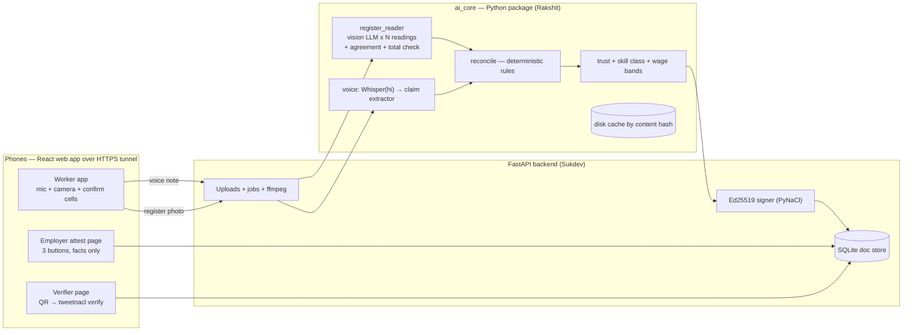

# PRAMAN (प्रमाण) — Build Plan & Agent Playbook

**Migrant Worker Skill Passport · CODE कलेश 2026 · Envelope No. 82**
Team: **Rakshit (R)** · **Sukdev (S)** · **Namha** · **Nishtha**
Put this file at `docs/PLAN.md` in the repo. Data shapes live in `contracts/schemas.py` (Section 7).

---

## 0. How to use this document

1. Everyone reads **Sections 1–4** (15 min). Then read **your own section** (8 = Rakshit, 9 = Sukdev, 10 = Namha, 11 = Nishtha).
2. Coders: every agent prompt in Sections 8–9 is **copy-paste ready**. Each starts with "read AGENTS.md first". If your IDE doesn't auto-read `AGENTS.md`, keep that line.
3. Nobody edits files outside their ownership map (Section 3). This is what lets four people (and six agents) work at the same time and merge without conflicts.
4. We integrate at fixed checkpoints (CP0 / CP1 / CP2 / FREEZE). If we are behind at a checkpoint, we cut scope using the order in Section 14. We never cut the golden path.
5. Times are clock times assuming **H0 = 10:30 PM**. The plan assumes ~10 productive hours; the last 2 of the 12 are buffer for rehearsal and sleep. **Do not spend the buffer on new features.**

**The brief's 5 deliverables and where they live**

| # | Brief asks for | Our answer | Owner |
|---|---|---|---|
| 1 | Research the problem: who has it, cost, who solves it and where they fall short, market size, one real number | `pitch/FACTS.md` — the ₹181/day number, competitor gap table, 70M+ workers | Nishtha |
| 2 | Business plan: what we sell, who pays, how much, why switch | Free worker passport + paid verification for EPCs/principal employers | Nishtha |
| 3 | Automate one step with AI + build a demo, show before and after | Verification of work history (register photo + voice + attestation → signed passport). Before: "Unskilled ₹827". After: "Skilled ₹1,008" | Rakshit + Sukdev |
| 4 | ≥5 slides | 7 slides (Section 11) | Nishtha |
| 5 | 2-minute pitch | Script in Section 11 | Everyone |

---

## 1. What we are building

### 1.1 One-paragraph explanation
**Praman** takes the evidence a migrant construction worker *already has* — a thekedar's handwritten hazri (attendance) register, a Hindi voice note, and a one-tap confirmation from an old contractor — and turns it into a **signed, tamper-evident, worker-owned skill passport in about a minute**. The passport shows verified days, sites, trade, an evidence-strength score, and the **wage the worker should get on day one**. A new contractor scans a QR code and sees the signature verified and the wage band.

### 1.2 The one number
Central minimum wages effective 1 Apr 2026 (Area A): **skilled ₹1,008/day vs unskilled ₹827/day**. A mason classed as unskilled loses **₹181/day (~22%, ≈ ₹4,700/month at 26 days)**. Areas B and C: ₹225/day gap. *Verify against the official notification before the deck is final; the notification runs 1 Apr–30 Sep 2026.*

### 1.3 Demo flow (45 s live)
1. **Before** — Contractor screen: "Rakesh, no documents → Unskilled, ₹827/day".
2. **Voice** — Rakesh speaks ~15 s in Hindi; claims appear as structured chips (trade, years, sites).
3. **Register photo** — He photographs a hazri page; the AI finds his row, reads every day cell three independent ways, colour-codes agreement, and asks him to confirm the 2 shaky cells.
4. **Employer attestation** — Link/QR to a second phone ("Sunil thekedar"). One tap: "Yes, he worked with me."
5. **Passport** — "Mason · Skilled · 1,860 verified days · 5 sites" + QR + trust breakdown + wage band.
6. **Verifier scan** — New contractor scans QR → "Signature valid" → wage ₹1,008 vs ₹827.
7. **Tamper test** — Edit one field → signature visibly fails.

> **Honesty note (know this before a judge asks).** 1,860 days cannot come from one photo. The passport is **cumulative**: Rakesh's account is pre-seeded with 4 earlier sites (records marked `origin=seeded`); the live step adds the 5th. Say this out loud in the pitch if asked: "four earlier sites are pre-loaded, the fifth is live."

### 1.4 Architecture



| Layer | Tech | What it does | Owner |
|---|---|---|---|
| UI | React 18 + Vite + TypeScript + Tailwind, react-router, qrcode.react, tweetnacl | Mobile-first worker / employer / verifier / contractor screens, Hindi + English | Sukdev |
| Capture | MediaRecorder (mic), `<input type=file capture=environment>` (camera) | Voice note + register photo. Both have an upload fallback | Sukdev |
| API | FastAPI + Uvicorn, Pydantic v2, SQLite (JSON doc store), ffmpeg | Uploads, background jobs with stage progress, attestation links, passport issue | Sukdev |
| Register reading | Multimodal LLM (default `claude-sonnet-5`; Gemini optional) run N times independently, Pillow preprocessing, rapidfuzz name match | Reads the hazri grid; **confidence = agreement between independent readings + internal consistency (written total vs counted days)** | Rakshit |
| Voice | faster-whisper (`medium`, `language="hi"`) → LLM structured extraction; typed-text fallback | Transcript → `VoiceClaim` (name, trade, years, sites) | Rakshit |
| Reconcile / trust / skill / wage | **Plain deterministic Python + pytest** | Same-day-two-sites conflicts, totals, claim vs evidence gap, trust score, skill class, wage bands | Rakshit |
| Signing | Ed25519: PyNaCl (server) + tweetnacl (browser) over a **canonical JSON string** | Tamper-evident passport, no blockchain | Sukdev |
| Eval | pandas + matplotlib | Field-level accuracy, confusion matrix, **risk–coverage curve** | Rakshit (agent) + Namha (data) |
| Infra | cloudflared tunnel (HTTPS for phone mic/camera), GitHub + Actions | Phones reach the laptop; CI smoke | All |

### 1.5 Design decisions (these are our technical story — don't change them casually)
1. **Confidence comes from agreement, not self-report.** LLM-stated confidence is poorly calibrated. We run several independent readings (different prompt wording / cell order / model where available) and treat disagreement, unreadable marks, and a written-total mismatch as "needs human confirmation". This is selective classification: the system **abstains and asks** instead of guessing.
2. **LLM extracts; code decides.** Reconciliation, trust score, skill class and wage band are deterministic and unit-tested. The LLM never assigns a skill class.
3. **Sign a string, not an object.** The server signs the exact UTF-8 `payload_canonical` string; the browser verifies that same string and renders the display from it. This avoids Python-vs-JS JSON canonicalisation bugs. The verifier **pins the issuer public key** and never trusts a key shipped inside the passport.
4. **Cumulative passport with honest provenance.** Every record has `evidence` (self_claim / register / attested) and `origin` (live / seeded).
5. **Facts only.** Attestations record dates and role. No ratings, no free text. A passport cannot become a blacklist.
6. **Privacy by design.** Fictional workers only. No Aadhaar, no phone number in the signed payload; `worker_ref` is random.
7. **Cache everything by content hash.** After the first run of the golden inputs, the demo works offline (`AI_CACHE=replay-only`). The live path is real; the cache is for reliability. Say so if asked.
8. **Skill thresholds are policy parameters** (`contracts/rules.json`), illustrative, and the passport says "evidence-based suggestion, not a legal classification".

### 1.6 MVP screens ↔ API ↔ AI functions

| Step | Screen | API call | `ai_core.api` function |
|---|---|---|---|
| Start | `/worker` | `POST /api/workers/session` | — |
| Voice | `/worker/voice` | `POST /api/voice` → poll `GET /api/jobs/{id}` | `process_voice` |
| Register | `/worker/register` | `POST /api/registers` → poll job | `read_register` |
| Confirm cells | same screen | `POST /api/registers/{extraction_id}/confirm` | `build_work_record`, `reconcile` |
| Attest | `/worker/attest` | `POST /api/attestations` | — |
| Employer tap | `/attest/:token` | `GET`/`POST /api/attestations/{token}` | — |
| Passport | `/worker/passport` | `POST /api/passports` | `reconcile`, `score_passport` + signing |
| Verify | `/verify/:id` | `GET /api/passports/{id}` | — (verified in browser) |

---

## 2. Timeline and checkpoints (H0 = 22:30)

| Clock | Hour | Phase | Ends with |
|---|---|---|---|
| 22:30–23:30 | H0–H1 | **Phase 0** kickoff: repo, contract, mock API, first data | **CP0** |
| 23:30–02:30 | H1–H4 | **Phase 1** parallel build against mocks | **CP1** (merge) |
| 02:30–04:30 | H4–H6 | **Phase 2** swap mocks for real AI, golden path on phones | **CP2** (merge) |
| 04:30–06:30 | H6–H8 | **Phase 3** harden, eval numbers, QA on 2 phones, screenshots | **FEATURE FREEZE 06:30** (tag `freeze-h8`) |
| 06:30–08:00 | H8–H9:30 | **Phase 4** polish, fallback video, deck finalised | **MVP LOCKED 08:00** (tag `demo-final`) |
| 08:00–10:30 | H9:30–H12 | Rehearse ×5, buffer, sleep rotation | Pitch |

Nishtha builds the deck from **H1 in parallel**, so locking the MVP at 09:30-equivalent does not squeeze slides.
Naps: Namha and Nishtha 03:30–04:15 (staggered). Coders after FREEZE: Sukdev 06:30–07:00, Rakshit 07:00–07:30, the other one on bug duty.

Checkpoint exit criteria are in **Section 12**.

---

## 3. Ownership map (the anti-conflict rule)

| Path | Owner | Notes |
|---|---|---|
| `contracts/schemas.py`, `contracts/rules.json`, `contracts/wage_table.json` | **Shared — change only via PR labelled `contract-change`** | Both R and S review. Update `frontend/src/lib/types.ts` in the same PR |
| `contracts/fixtures/*.json` | Sukdev (agent S0B creates) | Used by mock mode |
| `ai_core/` | Rakshit — by agent: R0 = `config.py llm.py cache.py mock.py api.py cli.py bakeoff.py`; RA = `register_reader.py image_prep.py aggregate.py prompts/register_*`; RB = `voice.py asr.py prompts/voice_*`; RC = `reconcile.py records.py trust.py wage.py` | Each agent edits only its files |
| `eval/` | Rakshit (agent RC) | |
| `data/` | Namha | Photos, audio, ground truth, demo assets |
| `backend/`, `scripts/` | Sukdev — S0B then SA | |
| `frontend/src/lib`, `components/ui`, `App.tsx`, `i18n/en/*` skeleton, config, `package.json` | Sukdev (agent S0F, then Sukdev by hand) | New dependency? Ask Sukdev |
| `frontend/src/features/worker/**`, `i18n/en/worker.json` | Agent SB | |
| `frontend/src/features/{verify,attest,contractor,evidence}/**`, `i18n/en/{verify,attest,contractor}.json` | Agent SC | |
| `frontend/src/i18n/hi/*.json` | Namha | Hindi translations only |
| `pitch/`, `docs/facts` | Nishtha | Deck, scripts, facts |
| `.github/`, root files, `AGENTS.md` | Rakshit | |

**If you need a change in a file you don't own: message the owner. Do not edit it.**

---

## 4. GitHub plan

### 4.1 Model: monorepo, trunk-based, short-lived branches
- One private repo: **`praman`**. `main` is **always runnable** (mock mode works).
- One branch per agent/person, named `<area>/<topic>`, merged to `main` by pull request (squash merge).
- Ownership by directory (Section 3) means merges are almost conflict-free.

| Branch | Owner | Worktree |
|---|---|---|
| `ai/scaffold` (R0) | Rakshit | main checkout |
| `ai/register-reader` (RA) | Rakshit | `../praman-ra` |
| `ai/voice` (RB) | Rakshit | `../praman-rb` |
| `ai/reconcile` (RC) | Rakshit | `../praman-rc` |
| `app/backend-skeleton` → `app/backend` (S0B, SA) | Sukdev | `../praman-sa` |
| `app/fe-scaffold` (S0F) | Sukdev | `../praman-s0f` |
| `app/fe-worker` (SB) | Sukdev | `../praman-sb` |
| `app/fe-verify` (SC) | Sukdev | `../praman-sc` |
| `data/registers` | Namha | her own clone |
| `pitch/deck` | Nishtha | her own clone (or just Google Slides + upload) |

### 4.2 One-time setup (Rakshit, H0:00–0:15)
```bash
gh auth login
gh repo create praman --private --clone && cd praman
# create the skeleton (Section 6), commit, then:
git branch -M main && git push -u origin main
```
GitHub web → **Settings → Collaborators** → add Sukdev, Namha, Nishtha (Write).
**Settings → Branches → Add rule for `main`:** require a pull request before merging (**0 required approvals** — speed matters), block force-push, and turn on "Automatically delete head branches".
Settings → General → Pull Requests → allow **squash merging** only.

### 4.3 Daily commands for coders
```bash
# start a task in an isolated worktree (one per parallel agent)
git fetch origin
git worktree add ../praman-ra -b ai/register-reader origin/main

# work, commit often (every 20–30 min), push at least hourly
git add -A && git commit -m "feat(ai): aggregate readings into RegisterExtraction"
git push -u origin ai/register-reader

# before opening a PR
git fetch origin && git rebase origin/main
# run: PYTHONPATH=. pytest -q -m "not live"   and   cd frontend && npm run build
gh pr create --fill --base main
gh pr merge --squash --delete-branch      # after a quick glance

# after ANY merge to main, everyone:
git fetch origin && git rebase origin/main
```
- **Python:** create **one shared venv** (`python -m venv ~/.venvs/praman && source ~/.venvs/praman/bin/activate && pip install -r requirements.txt`). Do **not** `pip install -e .`. Run everything from the worktree root with `PYTHONPATH=.` so each worktree imports its own copy of `ai_core`.
- **Node:** each frontend worktree needs its own `npm install`. Give each dev server its own port: SB `--port 5173`, SC `--port 5174`, S0F `--port 5175`.
- **Backend port:** main checkout uses 8000; a worktree that needs its own backend uses `PORT=8001` etc.

### 4.4 Commit and PR conventions
- Commit messages: `type(scope): message` — types `feat fix chore docs test data pitch`; scopes `ai backend fe contract eval data pitch`.
- PR title = same format. Use the PR template (Appendix D). Label `contract-change` if `contracts/` is touched; tag both R and S.
- Squash merge. Delete branch after.

### 4.5 Merge cadence
- **Merge when a piece works, not at the end.** Anything mergeable goes in within 10 minutes of being done.
- **Hard merge windows:** CP0 (H1), CP1 (H4), CP2 (H6), FREEZE (H8).
- **Merge order at a checkpoint:** contract → ai_core → backend → frontend → data → pitch.
- **Contract changes:** tiny PR, both coders review, merged within 10 minutes, announced in the WhatsApp group ("contract-change merged: added X — rebase now").
- **Shared-file rules:** root `requirements.txt` is just `-r ai_core/requirements.txt -r backend/requirements.txt` and never edited again. Each agent adds deps only to *its own* requirements file. Frontend dependencies are installed once by S0F; later additions only by Sukdev on `main`, then both FE agents rebase.

### 4.6 Data and non-code contributors (Namha, Nishtha)
Use **GitHub Desktop** (no terminal): Clone → Branch → New branch `data/registers` → drop files in the folder → write a commit message → Commit → Push origin → **Create Pull Request**. A coder merges. Photos: JPEG, ≤ 2 MB, named `R01.jpg`…; audio `V01.m4a`… No Git LFS needed.

### 4.7 Secrets
- `.env` is git-ignored. Only `.env.example` is committed. Share real keys through a private message, never in the repo, never in an agent prompt.
- The signing key (`PRAMAN_SIGNING_SEED_B64`) is generated once by `scripts/gen_keys.py`, lives in Sukdev's `.env`, and the **public** key goes into `VITE_PRAMAN_PUBKEY`.

### 4.8 Safety net
- Tags: `cp0`, `cp1`, `cp2`, `freeze-h8`, `demo-final`. The demo laptop runs **a checkout of `demo-final`**, not a moving `main`.
- At FREEZE, after the tag: `git checkout -b release/demo freeze-h8`. Only cherry-picked bug fixes from then on.
- At `demo-final`, also zip the repo + `.cache/ai` + `backend/uploads` + `backend/praman.db` and copy to a USB stick and Google Drive.
- Bad merge? `git revert -m 1 <sha>` — never force-push `main`.

---

## 5. Pre-event checklist (do before 22:30 — or in the first 15 minutes)

**Ask the organisers in the WhatsApp group (Nishtha sends it, Rakshit follows up):**
- What is allowed pre-event (accounts, keys, model downloads, setting up environments)? If pre-written code is banned, **do not commit code before H0** — only install tools and download models. This plan writes all code inside the event.
- Are external LLM APIs allowed? Wi-Fi quality, power points, projector connector (HDMI/USB-C), can we bring props (notebooks, pens)? Judging rubric? Team-size rule?

**Everyone**
- GitHub account; send your username to Rakshit. Join the team WhatsApp group.
- Phone charged; cloudflared not needed on your phone. Nishtha/Namha: install **GitHub Desktop**.

**Rakshit + Sukdev (laptops)**
- Git, `gh` CLI, Python 3.11+, Node 20+, **ffmpeg**, **cloudflared** (or ngrok), your agentic IDE — and **check each person's usage quota** (parallel agents burn it quickly).
- API keys: at least one **vision-capable LLM key with enough quota** (Anthropic; Gemini as a second reader is a bonus). Test with a single image call.
- Pre-download the Whisper model once so venue Wi-Fi can't hurt you:
  `python -c "from faster_whisper import WhisperModel; WhisperModel('medium', compute_type='int8')"`
- Sukdev: `python scripts/gen_keys.py` later (after repo exists).

**Namha + Nishtha (props to bring)**
- 2–3 ruled/long notebooks or blank A4 sheets, a ruler, **blue pen, black pen, red pen, pencil**, an eraser, a highlighter, a phone stand. Extension board, chargers, power bank, hotspot-capable phone.

---

## 6. Phase 0 — kickoff (H0:00–H1:00)

**Goal (CP0):** repo exists with contract + skeleton, mock API runs, frontend shell runs, first 3 register photos + 2 voice notes exist.

### 6.1 Rakshit (H0:00–0:20) — create the repo
```bash
gh repo create praman --private --clone && cd praman
mkdir -p contracts/fixtures ai_core/prompts ai_core/tests eval/out data/registers data/voice data/ground_truth data/demo \
         backend/app/routers backend/tests frontend pitch docs scripts .github/workflows
touch contracts/fixtures/.gitkeep data/registers/.gitkeep data/voice/.gitkeep data/ground_truth/.gitkeep data/demo/.gitkeep
cp <this file> docs/PLAN.md
```
Then create these files exactly as given in this document:
1. `contracts/schemas.py` — Section 7.1
2. `contracts/rules.json`, `contracts/wage_table.json` — Section 7.4
3. `AGENTS.md` — Appendix A
4. `.env.example` — Appendix B
5. `.gitignore`, `.github/CODEOWNERS`, `.github/pull_request_template.md`, `.github/workflows/smoke.yml` — Appendix C–E
6. `requirements.txt` containing exactly: `-r ai_core/requirements.txt` and `-r backend/requirements.txt`
7. `pytest.ini` — `[pytest]` / `markers = live: hits real APIs (deselect with -m "not live")` / `pythonpath = .`

```bash
git add -A && git commit -m "chore: scaffold monorepo + contract" && git branch -M main && git push -u origin main
git tag cp0-scaffold && git push --tags
```
Add collaborators, set branch rule (4.2). **Post in the group: "Repo is live — clone, then read Section 3 and your own section."**

### 6.2 Rakshit (H0:20–1:00)
Launch agent **R0** (Section 8.2) on branch `ai/scaffold`. While it runs: write your own **bake-off notes** and wait for Namha's first 3 photos (Section 10).

### 6.3 Sukdev (H0:20–1:00)
Clone, set up the shared venv, `npm` available. Launch **S0B** (backend skeleton + fixtures) and **S0F** (frontend scaffold) in parallel worktrees (Section 9.2–9.3). Get the cloudflared tunnel working against `localhost:8000` and confirm a phone can open it.

### 6.4 Namha (H0:00–1:00)
Clone the repo with GitHub Desktop, branch `data/registers`. **Deliver by H0:45: 3 register photos + 2 voice notes** (Section 10.2) — Rakshit's bake-off needs them. Then continue with the full set.

### 6.5 Nishtha (H0:00–1:00)
Post the organiser questions (Section 5). Start `pitch/FACTS.md` and the deck skeleton (Section 11).

### 6.6 CP0 check (H1:00, 10 minutes, all four)
- `main` has contract + skeleton; R0 and S0B/S0F PRs open or merged.
- `curl localhost:8000/api/health` returns ok; frontend shell loads on a phone through the tunnel.
- 3 register photos + 2 voice notes are in `data/`.

---

## 7. The contract (single source of truth)

### 7.1 `contracts/schemas.py` — copy exactly

```python
"""contracts/schemas.py — SINGLE SOURCE OF TRUTH for every data shape.
Change only via a PR labelled `contract-change`. Mirror changes in frontend/src/lib/types.ts.
Fictional data only. No Aadhaar, no phone numbers in anything that gets signed."""
from __future__ import annotations
from datetime import date, datetime
from enum import Enum
from typing import Literal, Optional, Union
from pydantic import BaseModel, Field

SCHEMA_VERSION = "1.0"


# ---------- enums ----------
class Trade(str, Enum):
    mason = "mason"; carpenter = "carpenter"; bar_bender = "bar_bender"; plumber = "plumber"
    electrician = "electrician"; painter = "painter"; welder = "welder"; tiler = "tiler"
    helper = "helper"; other = "other"

class SkillClass(str, Enum):
    unskilled = "unskilled"; semi_skilled = "semi_skilled"; skilled = "skilled"; highly_skilled = "highly_skilled"

class Mark(str, Enum):
    present = "P"; absent = "A"; half = "H"; unreadable = "?"

class EvidenceLevel(str, Enum):
    self_claim = "self_claim"   # voice only
    register = "register"       # register page read + worker confirmed uncertain cells
    attested = "attested"       # + employer confirmed

class Origin(str, Enum):
    live = "live"; seeded = "seeded"


# ---------- register reading ----------
class ReadField(BaseModel):
    value: Optional[str] = None
    confidence: float = Field(0.0, ge=0, le=1)        # agreement across readings
    needs_confirmation: bool = False
    alternatives: list[str] = []

class DayCell(BaseModel):
    day: int = Field(ge=1, le=31)
    mark: Mark
    confidence: float = Field(ge=0, le=1)             # = share of readings that voted for `mark`
    needs_confirmation: bool
    alternatives: list[Mark] = []
    reasons: list[str] = []                           # readers_disagree | unreadable | total_mismatch

class RegisterRow(BaseModel):
    row_index: int
    name_raw: str                                     # exactly as written (Devanagari stays Devanagari)
    name_latin: Optional[str] = None                  # romanised by the reader, used for matching
    name_match_score: float = 0.0                     # 0..1 vs target name
    is_target: bool = False
    bbox: Optional[list[float]] = None                # [x0,y0,x1,y1] fractions of preprocessed image
    cells: list[DayCell]
    written_total: Optional[float] = None
    computed_total: float
    total_consistent: Optional[bool] = None

class RegisterHeader(BaseModel):
    site_name: ReadField
    contractor_name: ReadField
    month: ReadField                                  # "1".."12"
    year: ReadField

class RegisterExtraction(BaseModel):
    extraction_id: str
    image_id: str
    image_url: Optional[str] = None                   # filled by backend (preprocessed image)
    image_width: Optional[int] = None
    image_height: Optional[int] = None
    header: RegisterHeader
    rows: list[RegisterRow]
    n_samples: int
    models: list[str]
    warnings: list[str] = []
    elapsed_s: float = 0.0


# ---------- voice ----------
class ClaimedSite(BaseModel):
    site_name: Optional[str] = None
    city: Optional[str] = None
    employer_name: Optional[str] = None
    approx_from_year: Optional[int] = None
    approx_to_year: Optional[int] = None

class VoiceClaim(BaseModel):
    claim_id: str
    transcript: str
    language: str = "hi"
    name: Optional[str] = None
    trade: Optional[Trade] = None
    years_experience: Optional[float] = None
    sites: list[ClaimedSite] = []
    confidence: float = 0.0
    asr_backend: str = ""


# ---------- work records, reconciliation, trust ----------
class WorkRecord(BaseModel):
    record_id: str
    worker_id: str
    site_name: str
    employer_name: Optional[str] = None
    city: Optional[str] = None
    role: Optional[Trade] = None
    period_from: date
    period_to: date
    days_worked: float                                 # P=1, H=0.5
    day_marks: dict[str, str] = {}                     # ISO date -> "P"|"H" (worked days only)
    evidence: EvidenceLevel
    origin: Origin = Origin.live
    image_id: Optional[str] = None
    cells_confirmed_by_worker: int = 0
    cells_auto_accepted: int = 0
    attestation_id: Optional[str] = None
    attestation_status: Optional[Literal["pending", "confirmed", "disputed", "unknown"]] = None

class Flag(BaseModel):
    code: str          # SAME_DAY_TWO_SITES | TOTAL_MISMATCH | DATE_INVALID | CLAIM_EXCEEDS_EVIDENCE | TRADE_MISMATCH | NAME_LOW_MATCH | DUPLICATE_PAGE | ATTESTATION_DISPUTED | ATTESTATION_DATES_DIFFER
    severity: Literal["info", "warn", "conflict"]
    message: str
    record_ids: list[str] = []

class ReconciliationReport(BaseModel):
    verified_days: float
    verified_sites: int
    attested_sites: int
    evidenced_span_years: float                        # verified_days / 260 (work-years)
    claimed_years: Optional[float] = None
    flags: list[Flag] = []

class TrustResult(BaseModel):
    score: int = Field(ge=0, le=100)
    level: Literal["low", "medium", "high"]
    breakdown: dict[str, float]                        # coverage, attestation, consistency, claim_alignment
    suggested_class: SkillClass
    class_reason: str

class WageBand(BaseModel):
    area: Literal["A", "B", "C"]
    suggested_class: SkillClass
    daily_wage: float
    unskilled_daily_wage: float
    delta_per_day: float
    delta_pct: float
    monthly_delta_26d: float
    source: str
    effective_from: date
    effective_to: date


# ---------- API in/out ----------
class WorkerSession(BaseModel):
    worker_id: str
    created_at: datetime

class Job(BaseModel):
    job_id: str
    kind: Literal["register", "voice"]
    status: Literal["queued", "running", "done", "error"]
    stage: str = ""                                    # preprocess | reading 1/3 ... | cross-check | done
    progress: float = 0.0
    result: Optional[Union[RegisterExtraction, VoiceClaim]] = None
    error: Optional[str] = None

class CellCorrection(BaseModel):
    row_index: int
    day: int
    mark: Mark

class ConfirmRegisterIn(BaseModel):
    worker_id: str
    target_row_index: int
    corrections: list[CellCorrection] = []             # MUST cover every needs_confirmation cell of the target row
    site_name: Optional[str] = None
    employer_name: Optional[str] = None
    city: Optional[str] = None
    month: Optional[int] = None
    year: Optional[int] = None
    role: Optional[Trade] = None

class ConfirmRegisterOut(BaseModel):
    record: WorkRecord
    report: ReconciliationReport

class CreateAttestationIn(BaseModel):
    record_id: str
    employer_name: Optional[str] = None

class AttestationView(BaseModel):
    token: str
    record_id: str
    worker_display_name: str
    site_name: str
    period_from: date
    period_to: date
    days_claimed: float
    role: Optional[Trade] = None
    status: Literal["pending", "confirmed", "disputed", "unknown"]
    url: str
    created_at: datetime

class AttestationResponseIn(BaseModel):
    decision: Literal["confirmed", "disputed", "unknown"]
    employer_name: str
    corrected_from: Optional[date] = None
    corrected_to: Optional[date] = None
    # DESIGN: no free text and no rating fields. Facts only. Do not add any.

class IssuePassportIn(BaseModel):
    worker_id: str


# ---------- passport ----------
class PassportWorker(BaseModel):
    worker_ref: str                                    # random id; never Aadhaar/phone
    display_name: str                                  # first name (+ initial)
    trade: Optional[Trade] = None

class PassportRecordSummary(BaseModel):
    site_name: str
    employer_name: Optional[str] = None
    city: Optional[str] = None
    role: Optional[Trade] = None
    period_from: date
    period_to: date
    days_worked: float
    evidence: EvidenceLevel
    origin: Origin

class PassportPayload(BaseModel):                      # <- this is what gets signed
    schema_version: str = SCHEMA_VERSION
    passport_id: str
    issued_at: datetime
    worker: PassportWorker
    records: list[PassportRecordSummary]
    verified_days: float
    verified_sites: int
    attested_sites: int
    claimed_years: Optional[float] = None
    evidenced_span_years: float
    trust: TrustResult
    wage_bands: dict[str, WageBand]                    # keys "A","B","C"
    flags: list[Flag] = []
    issuer: str = "Praman (hackathon demo)"

class SignedPassport(BaseModel):
    payload_canonical: str    # exact UTF-8 string that was signed = json.dumps(payload.model_dump(mode="json"), sort_keys=True, separators=(",",":"), ensure_ascii=False)
    signature_b64: str        # Ed25519 detached signature over payload_canonical.encode("utf-8")
    key_id: str               # first 8 hex chars of sha256(public key bytes)
    public_key_b64: str       # convenience only. Verifiers MUST pin the issuer key.
    verify_url: str
```

### 7.2 API surface (all under `/api`)

| Method + path | Body / params | Returns |
|---|---|---|
| `GET /health` | — | `{"ok": true, "ai_mode": "mock"\|"real"}` |
| `GET /pubkey` | — | `{"key_id","public_key_b64"}` |
| `GET /wage-table` | — | contents of `contracts/wage_table.json` |
| `POST /workers/session` | — | `WorkerSession` |
| `POST /voice` | multipart `audio`, `worker_id`; optional `transcript_override` (typed fallback) | `{"job_id"}` (202) |
| `POST /registers` | multipart `image`, `worker_id`, optional `target_name` | `{"job_id"}` (202) |
| `GET /jobs/{job_id}` | — | `Job` |
| `POST /registers/{extraction_id}/confirm` | `ConfirmRegisterIn` | `ConfirmRegisterOut` (422 if any needs-confirmation cell of the target row is uncorrected) |
| `GET /workers/{worker_id}/records` | — | `list[WorkRecord]` |
| `POST /attestations` | `CreateAttestationIn` | `AttestationView` |
| `GET /attestations/{token}` | — | `AttestationView` |
| `POST /attestations/{token}/respond` | `AttestationResponseIn` | `AttestationView` (also upgrades the record's evidence to `attested` if confirmed) |
| `POST /passports` | `IssuePassportIn` | `SignedPassport` |
| `GET /passports/{passport_id}` | — | `SignedPassport` (public) |
| `GET /files/{image_id}` | — | preprocessed image |
| `POST /demo/seed` / `POST /demo/reset` | (`DEMO_ROUTES=on` only) | seeds "Rakesh" with 4 earlier sites / wipes DB |

Job flow: `POST` returns `{job_id}` immediately; the client polls `GET /jobs/{id}` every ~700 ms and displays `stage` and `progress`.

### 7.3 Signing spec
- `canonical = json.dumps(payload.model_dump(mode="json"), sort_keys=True, separators=(",", ":"), ensure_ascii=False)`
- Signature: Ed25519 (PyNaCl `SigningKey`, 32-byte seed from `PRAMAN_SIGNING_SEED_B64`) over `canonical.encode("utf-8")`.
- Browser: `nacl.sign.detached.verify(new TextEncoder().encode(canonical), sigBytes, pubKeyBytes)` (tweetnacl). The verifier UI **parses `payload_canonical` to display** — it never shows a separate copy.
- The verifier pins the public key from `VITE_PRAMAN_PUBKEY` (build-time); falls back to `/api/pubkey` only in dev.

### 7.4 Shared config files

`contracts/rules.json`
```json
{
  "skilled_trades": ["mason","carpenter","bar_bender","plumber","electrician","painter","welder","tiler"],
  "skill_thresholds": {"skilled_min_days": 500, "skilled_min_attested_sites": 1, "semi_skilled_min_days": 120},
  "trust": {"coverage_full_days": 720, "weights": {"coverage": 40, "attestation": 30, "consistency": 20, "claim_alignment": 10}, "level_high": 70, "level_medium": 40},
  "work_days_per_year": 260,
  "work_days_per_month": 26,
  "confirm_below_agreement": 1.0,
  "name_match_min": 0.6,
  "note": "Thresholds are illustrative policy parameters, not a legal classification."
}
```

`contracts/wage_table.json` — **Namha must verify every number against the official notification before H6 and update `source`**
```json
{
  "effective_from": "2026-04-01",
  "effective_to": "2026-09-30",
  "source": "Central sphere minimum wages, construction (as relayed by compliance site; VERIFY against labour.gov.in notification)",
  "areas": {
    "A": {"unskilled": 827, "semi_skilled": null, "skilled": 1008, "highly_skilled": null},
    "B": {"unskilled": 693, "semi_skilled": null, "skilled": 918,  "highly_skilled": null},
    "C": {"unskilled": 556, "semi_skilled": null, "skilled": 781,  "highly_skilled": null}
  }
}
```
Semi-skilled wages are `null` in the table; `wage.py` must fall back to the unskilled wage for `semi_skilled` and clearly label it in `source`, unless Namha fills the real value.

### 7.5 Trust score and classification (implemented in `ai_core/trust.py`, deterministic)
- `coverage = 40 * min(verified_days / 720, 1)`
- `attestation = 30 * (attested_days / verified_days)` (0 if no verified days)
- `consistency = max(0, 20 − 10·#conflict − 2·#warn)`
- `claim_alignment = 10 * min(evidenced_span_years / claimed_years, 1)`; if no claim, use 5
- `score = round(sum)`; level: ≥70 high, ≥40 medium, else low.
- `suggested_class`: trade in `skilled_trades` **and** `verified_days ≥ 500` **and** `attested_sites ≥ 1` → skilled; else trade skilled and `verified_days ≥ 120` → semi_skilled; else unskilled. `class_reason` is a human-readable sentence built from these numbers.

### 7.6 Fixtures rule
`contracts/fixtures/` contains one valid JSON example for every response model (S0B creates them). **Mock mode (`AI_MODE=mock`) and the frontend's mock paths use only these.** Fixtures represent the Rakesh demo: 4 seeded records + a live register with 2 uncertain cells.

---

## 8. RAKSHIT — AI core, integration lead

**Your job in one line:** make the verification pipeline *trustworthy* (agreement-based abstention, deterministic reconciliation, honest eval) and own integration.
**You run 4 things:** agent **R0** (scaffold, then done), then agents **RA, RB, RC** in parallel worktrees. You stay hands-on for prompt tuning, error analysis, thresholds and integration debugging — do **not** delegate those.

### 8.1 Your timeline

| When | Do |
|---|---|
| H0:00–0:20 | Create repo (Section 6.1). |
| H0:20 | Launch **R0** (8.2). Create shared venv. |
| H0:45–1:15 | **Bake-off**: `python -m ai_core.bakeoff data/registers/*.jpg` on Namha's first 3 photos across the providers you have keys for. Pick the default reader model on **cell accuracy and latency**, write the winner into `.env`. Test Hindi transcription on Namha's 2 voice notes too. |
| H1:00 | Merge R0. Launch **RA** (8.3), **RB** (8.4), **RC** (8.5) in three worktrees at the same time. |
| H1–4 | Review agent output every ~45 min (read the diffs, run the code). Hands-on: run `read_register` on every photo Namha delivers, inspect flagged cells, iterate prompts `v1 → v2 → v3` (bump `PROMPT_VERSION` so the cache invalidates). Keep a short log in `docs/notes/ai_tuning.md`. |
| H3–4 | Get ground truth from Namha, run eval (RC). Look at the risk–coverage curve; choose `confirm_below_agreement`. **Merge RA/RB/RC = CP1 at H4.** |
| H4–6 | Integrate with Sukdev: `AI_MODE=real`, run `scripts/smoke.py`, fix contract mismatches. Choose the **demo page** from the eval set (a representative one, not a cherry-picked easy one). Warm the cache for the golden inputs. **CP2 at H6.** |
| H6–8 | Final eval run with `n_samples=5`; export `eval/out/summary.json`, `risk_coverage.png`, `confusion_matrix.png`, `report.md` → Nishtha. Help QA. **FREEZE 06:30.** |
| H8–9:30 | Bug fixes only. Record fallback demo video (screen + phone). Tag `demo-final`. |

### 8.2 Agent R0 — ai_core scaffold (branch `ai/scaffold`, main checkout)

```text
Read AGENTS.md and docs/PLAN.md sections 1, 3 and 7, and contracts/schemas.py first.

ROLE: You are agent R0 — you scaffold the `ai_core` Python package for Praman.
BRANCH: ai/scaffold. OWNS (edit only these): ai_core/__init__.py, ai_core/config.py, ai_core/llm.py, ai_core/cache.py, ai_core/mock.py, ai_core/api.py, ai_core/cli.py, ai_core/bakeoff.py, ai_core/requirements.txt, ai_core/tests/test_llm.py, ai_core/tests/test_mock.py, .env.example (append only).
DO NOT touch: contracts/, backend/, frontend/, or other ai_core files.

BUILD:
1. ai_core/config.py — pydantic-settings Settings loaded from .env: AI_MODE (real|mock), AI_CACHE (on|off|replay-only), LLM_PROVIDER (anthropic|gemini), ANTHROPIC_API_KEY, GEMINI_API_KEY, VISION_MODEL, TEXT_MODEL, READERS (int, default 3), ASR_BACKEND (whisper|gemini|mock), WHISPER_MODEL. Also load contracts/rules.json and contracts/wage_table.json into typed helpers `get_rules()` / `get_wage_table()`.
2. ai_core/cache.py — disk cache in .cache/ai/ keyed by sha256 of a canonical JSON of (provider, model, prompt_version, sample_idx, input_hash, extra). Modes: on = read+write, off = bypass, replay-only = cache hit or raise CacheMiss (used for offline demo). Store the raw validated JSON.
3. ai_core/llm.py — one class `LLM` with:
   `async def json_call(self, *, system: str, user_text: str, images: list[bytes] | None, schema: type[BaseModel], model: str | None = None, temperature: float | None = None, prompt_version: str, sample_idx: int = 0, extra: str = "") -> BaseModel`
   - Providers: Anthropic (messages API, base64 images, force structured output via a single forced tool call whose input_schema = schema.model_json_schema(); check the current SDK docs for exact params) and Gemini (google-genai, response_schema). Provider chosen by config; model per call overrides config.
   - If the provider rejects `temperature` (some models do), retry without it — diversity then comes from prompt variants, which callers supply.
   - Validate with the pydantic schema; on ValidationError retry up to 2 times feeding the error back. Exponential backoff on 429/5xx (tenacity). 60 s timeout. Global asyncio.Semaphore(4) for concurrency.
   - Cache every call via cache.py. Log latency + token usage.
4. ai_core/mock.py — implements the SAME async signatures as api.py below but returns objects built from contracts/fixtures/*.json (loaded lazily; if fixtures are missing yet, fall back to minimal valid objects built in code). Simulate latency with asyncio.sleep(1.5–3s) and call `progress(stage, fraction)` at ~5 steps ("preprocess", "reading 1/3", "reading 2/3", "reading 3/3", "cross-check").
5. ai_core/api.py — THE ONLY MODULE THE BACKEND IMPORTS. Signatures (do not change; the backend depends on them):
   ProgressCb = Callable[[str, float], None]
   async def read_register(image_path: str, *, target_name: str | None = None, progress: ProgressCb | None = None) -> RegisterExtraction
   async def process_voice(audio_path: str | None = None, *, transcript_override: str | None = None, progress: ProgressCb | None = None) -> VoiceClaim
   def build_work_record(extraction: RegisterExtraction, confirm: ConfirmRegisterIn, *, worker_id: str, origin: Origin = Origin.live) -> WorkRecord
   def reconcile(claim: VoiceClaim | None, records: list[WorkRecord], extra_flags: list[Flag] | None = None) -> ReconciliationReport
   def score_passport(claim: VoiceClaim | None, records: list[WorkRecord], report: ReconciliationReport) -> tuple[TrustResult, dict[str, WageBand]]
   Each function dispatches: if settings.AI_MODE == "mock" -> mock.py; else lazily import the real module (register_reader, voice, records, reconcile, trust, wage) — these are owned by other agents and may not exist yet; wrap the import so a missing module raises a clear NotImplementedError("<module> not merged yet").
6. ai_core/cli.py — `python -m ai_core.cli register <image> [--target NAME]`, `voice <audio>`; prints pretty JSON.
7. ai_core/bakeoff.py — `python -m ai_core.bakeoff <images...> [--gt data/ground_truth/registers.csv]`: for each configured provider/model, run one raw reading per image with a placeholder simple prompt, print latency and (if GT provided) rough cell accuracy. Output a small table. Make providers optional (skip if key missing).
8. ai_core/requirements.txt: pydantic>=2, pydantic-settings, anthropic, google-genai, tenacity, pillow, rapidfuzz, faster-whisper, numpy, pandas, matplotlib, pytest, pytest-asyncio, python-dotenv.
9. Tests (no network): cache hit/miss/replay-only behaviour; mock functions return schema-valid objects; api.py dispatch works in mock mode.

DEFINITION OF DONE: `AI_MODE=mock PYTHONPATH=. pytest -q -m "not live" ai_core/tests` passes; `AI_MODE=mock python -m ai_core.cli register data/registers/x.jpg` prints a valid RegisterExtraction. Commit in small conventional commits, push branch, open PR to main. In your final message list: what works, what's stubbed, exact commands, and any contract change you think is needed (do NOT change contracts yourself).
```

### 8.3 Agent RA — register reader (branch `ai/register-reader`, worktree `../praman-ra`)

```text
Read AGENTS.md and docs/PLAN.md sections 1, 7 and 8.3, contracts/schemas.py, ai_core/llm.py, ai_core/config.py first.

ROLE: You are agent RA — you build the uncertainty-aware handwritten-register reader.
BRANCH: ai/register-reader. OWNS (edit only these): ai_core/register_reader.py, ai_core/image_prep.py, ai_core/aggregate.py, ai_core/prompts/register_v1.txt, register_v2.txt, register_v3.txt, ai_core/tests/test_aggregate.py, ai_core/tests/test_register_live.py.
DO NOT touch: any other file. Ask Rakshit for changes elsewhere.

CONTEXT: The input is a phone photo of a handwritten hazri (attendance) register from an Indian construction site: a grid with a header (site, contractor, month/year), one row per worker (names in Devanagari, Latin, or mixed), day columns 1..31 (or a subset), marks such as tick, P, 1, A, dash, half-day, and possibly a total column. Photos can be angled, shadowed, compressed via WhatsApp, with overwritten cells.
KEY IDEA: LLM self-reported confidence is unreliable. We get confidence from AGREEMENT between several independent readings plus INTERNAL CONSISTENCY (written total vs counted days). Disagreement => needs_confirmation. The system must abstain rather than guess.

BUILD:
1. image_prep.py: `prepare(image_path) -> PreparedImage(bytes_jpeg, width, height, image_id)`: Pillow ImageOps.exif_transpose; convert RGB; resize so longest side <= 2000px; mild autocontrast; JPEG quality 90; image_id = first 12 hex of sha256 of the ORIGINAL bytes. Provide `save_prepared(prepared, dir)`.
2. Internal raw schema (define inside register_reader.py, NOT in contracts): RawReading { header: {site_name, contractor_name, month, year}(all Optional[str]); rows: list[RawRow] } ; RawRow { name_raw: str, name_latin: Optional[str], bbox: Optional[list[float]], cells: list[{day:int, mark:"P"|"A"|"H"|"?", alt: Optional[str]}], written_total: Optional[float] }.
3. Prompts (files in ai_core/prompts/, versioned via PROMPT_VERSION constant): three DIFFERENT wordings so errors decorrelate. v1 = read rows top-to-bottom; v2 = same task but first list the day-column numbers you can see, then fill each row; v3 = read rows bottom-to-top and read each row's days right-to-left. All share these rules (put them in every prompt): (a) transcribe exactly what is written, do not correct mistakes, do not invent rows or days; (b) name_raw exactly as written, keep Devanagari as Devanagari, and also give name_latin (romanised); (c) map tick/P/1/| -> "P", A/dash/blank -> "A", half/½/H -> "H", anything you cannot decide -> "?" and put your best alternative in `alt`; (d) written_total = the number in the row's total column if any, else null; (e) bbox = approximate [x0,y0,x1,y1] of the row as fractions of image width/height; (f) header fields as written or null; month as 1-12; (g) return ONLY JSON matching the schema.
4. register_reader.py: `async def read_register(image_path, *, target_name=None, progress=None, n_samples=None) -> RegisterExtraction`:
   - prepare image; run n_samples (default settings.READERS) readings CONCURRENTLY via LLM.json_call, cycling prompt variants v1,v2,v3,v1,v2 and sample_idx = i; use temperature only if supported (e.g. 0.7 for i>0). Optionally alternate models if a READER_MODELS list is configured. Call progress("preprocess",0.05), then progress(f"reading {k}/{n}", ...) as each finishes, then progress("cross-check",0.9).
   - Aggregate with aggregate.py, fill extraction_id (uuid4 hex[:12]), image_id, image_width/height, models, n_samples, elapsed_s. image_url stays None (backend fills it).
   - Provide a __main__: `python -m ai_core.register_reader path.jpg --target "राकेश"` pretty-prints the extraction plus a human-readable table of flagged cells.
5. aggregate.py — pure functions, no network, fully unit-tested:
   a. Drop invalid readings (record a warning); need >= 2 valid readings, else raise.
   b. Align rows across readings: reference = reading with most rows; match others by best rapidfuzz similarity on (name_latin or name_raw) with row order as tie-break; rows present in < 50% of readings are dropped with a warning.
   c. Header fields: majority vote; confidence = agreeing/total; needs_confirmation if confidence < 1.0 or value is None; alternatives = other voted values.
   d. Cells: union of days across readings; per (row, day) vote; winner = plurality; ties => "?"; confidence = votes_for_winner / n_valid; alternatives = other voted marks ordered by votes; needs_confirmation = confidence < rules.confirm_below_agreement OR mark == "?"; reasons: "readers_disagree" (if any dissent), "unreadable" (if "?").
   e. Totals: written_total = plurality of the readings' written_total; computed_total = sum(P=1, H=0.5). If written_total is not None and != computed_total: total_consistent=False, add reason "total_mismatch" to every cell in that row with confidence < 1 or mark "?" (and set needs_confirmation=True on them); if there are none, append a row-level warning string to extraction.warnings. If equal: total_consistent=True. If no written total: None.
   f. Name match: name_match_score = max(WRatio(target_latin, name_latin), WRatio(target_raw, name_raw))/100 using rapidfuzz; is_target = True for the single best row if score >= rules.name_match_min, else no row is target (UI will ask the worker to pick their row). Never mark two rows as target.
   g. bbox = per-coordinate median across readings, clipped to [0,1]; None if fewer than 2 readings provided one.
6. Tests: hand-built RawReading fixtures covering: unanimous; 2-1 split; 3-way split -> "?"; total mismatch escalation; row misalignment; missing header; Devanagari vs Latin name match ("राकेश" vs "Rakesh"). One @pytest.mark.live test that runs the real reader on a photo in data/registers/ if present.

DEFINITION OF DONE: `PYTHONPATH=. pytest -q -m "not live" ai_core/tests/test_aggregate.py` passes; with AI_MODE=real and a valid key, the __main__ run on a sample photo returns a schema-valid RegisterExtraction in < 30 s. Commit often, push, open a PR to main. Final message: what works, known weaknesses, how to run, and suggestions for prompt improvements — do not overfit prompts to one photo.
```

**Hands-on tuning loop (you, H2–H6):** run the reader on each new photo → open the image beside the JSON → note *why* wrong cells happened (bad handwriting? column misalignment? name alignment?) → change the prompt or aggregation → bump `PROMPT_VERSION` → re-run. Keep prompt changes general. Never tune on the demo page alone.

### 8.4 Agent RB — voice → claims (branch `ai/voice`, worktree `../praman-rb`)

```text
Read AGENTS.md and docs/PLAN.md sections 1, 7 and 8.4, contracts/schemas.py, ai_core/llm.py, ai_core/config.py first.

ROLE: You are agent RB — you build the Hindi/Hinglish voice-note → structured claims pipeline.
BRANCH: ai/voice. OWNS (edit only): ai_core/voice.py, ai_core/asr.py, ai_core/prompts/voice_claims_v1.txt, ai_core/tests/test_voice.py, ai_core/tests/test_voice_live.py.

BUILD:
1. asr.py: `transcribe(audio_path, *, backend=None) -> tuple[str, str]` returning (text, backend_name). Backends:
   - "whisper": faster-whisper WhisperModel(settings.WHISPER_MODEL, compute_type="int8") loaded lazily once (module-level singleton). Call with language="hi", vad_filter=True, beam_size=5, and an initial_prompt in Devanagari containing construction vocabulary (राजमिस्त्री, ठेकेदार, साइट, मिस्त्री, सरिया, बढ़ई, गुड़गाँव, नोएडा, मोहाली, चंडीगढ़). Force Devanagari output. Input may be webm/m4a/mp3/wav: convert first with ffmpeg to 16 kHz mono wav in a temp dir (subprocess; raise a clear error if ffmpeg is missing).
   - "gemini" (optional): send the audio to the Gemini API for transcription if a key exists.
   - "mock": if <audio>.txt sidecar exists return its content; else a fixed demo transcript.
   Cache transcripts by audio-file sha256 through ai_core.cache.
2. prompts/voice_claims_v1.txt: system prompt + 4 few-shot examples (Devanagari, Hinglish in Latin script, mixed, and one with number words like "दस साल", "paanch saal") mapping transcript -> VoiceClaim JSON. Rules: only extract what was said; unknown => null; trade must be one of the Trade enum values (राजमिस्त्री/मिस्त्री -> mason, बढ़ई -> carpenter, सरिया बाँधने वाला -> bar_bender, प्लंबर -> plumber, इलेक्ट्रीशियन -> electrician, पेंटर -> painter, वेल्डर -> welder, टाइल -> tiler, मजदूर/हेल्पर -> helper); years_experience as a number; sites list with city / site_name / employer_name / approximate years if mentioned; name as spoken (keep script). No inference of ratings or personal data beyond this schema.
3. voice.py: `async def process_voice(audio_path=None, *, transcript_override=None, progress=None) -> VoiceClaim`: progress("transcribing",0.2) -> ASR (skip if transcript_override) -> progress("extracting claims",0.7) -> LLM.json_call with schema = an internal LLM output model (claim fields without claim_id/asr_backend), then fill claim_id (uuid hex[:12]), transcript, asr_backend, language="hi", confidence (simple heuristic: fraction of {name, trade, years, >=1 site} present, capped by 1.0). Provide `python -m ai_core.voice <audio>`.
4. Tests (no network): ffmpeg conversion helper with a generated tone; claim post-processing/heuristic; a table-driven test of the extraction step using a stubbed LLM returning canned JSON. One @pytest.mark.live test that runs the real pipeline over data/voice/*.m4a|wav|webm and compares to data/ground_truth/voice.json if present (trade exact, years within +-1, name fuzzy, site-city recall).

DEFINITION OF DONE: unit tests pass; `python -m ai_core.voice data/voice/V01.m4a` prints a VoiceClaim in < 25 s on CPU using medium int8 (if slower, make the model size configurable and note it). Final message: measured latency, Hindi ASR quality notes (what words it got wrong), and what you'd change.
```

### 8.5 Agent RC — reconcile, trust, wage, records, eval (branch `ai/reconcile`, worktree `../praman-rc`)

```text
Read AGENTS.md and docs/PLAN.md sections 1, 7 (especially 7.4 and 7.5) and 8.5, contracts/schemas.py, contracts/rules.json, contracts/wage_table.json first.

ROLE: You are agent RC — you build the deterministic core (records, reconciliation, trust, wage) and then the evaluation harness. Everything here is plain Python with no LLM calls and must be unit-tested.
BRANCH: ai/reconcile. OWNS (edit only): ai_core/records.py, ai_core/reconcile.py, ai_core/trust.py, ai_core/wage.py, ai_core/tests/test_records.py, test_reconcile.py, test_trust.py, test_wage.py, eval/** (everything under eval/).

PART 1 — deterministic core
1. records.py `build_work_record(extraction, confirm, *, worker_id, origin=Origin.live) -> WorkRecord`: take the row with row_index == confirm.target_row_index; apply confirm.corrections (raise ValueError if any needs_confirmation cell of that row has no correction); month/year/site/employer/city from confirm overrides else from extraction.header values; build day_marks {ISO date: "P"|"H"} for worked days (skip "A"; a remaining "?" is treated as absent and counted in a warning); days_worked = P + 0.5*H; period_from/period_to = first/last worked date; evidence = register; cells_confirmed_by_worker = number of corrected needs_confirmation cells; cells_auto_accepted = the rest; image_id from extraction; record_id = uuid hex[:12]. Validate that the day exists in that month (e.g. no Feb 30): invalid days are dropped, and build_work_record returns them so the backend can pass them on; expose a helper `invalid_days(extraction, confirm) -> list[int]` and let reconcile() accept an optional `extra_flags: list[Flag]` argument (default None) that is merged into the report — the backend uses it to carry DATE_INVALID / TOTAL_MISMATCH flags.
2. reconcile.py `reconcile(claim, records) -> ReconciliationReport`:
   - Build date -> set(sites) from all records' day_marks. A date at >= 2 distinct sites => Flag SAME_DAY_TWO_SITES (severity conflict) listing record_ids; those dates are EXCLUDED from verified_days. Same site + same date more than once (duplicate page) counts once and raises DUPLICATE_PAGE (warn).
   - verified_days = sum over unique (date) of 1 or 0.5 after exclusions. verified_sites = number of distinct site_name among records; attested_sites = those with evidence == attested.
   - evidenced_span_years = verified_days / rules.work_days_per_year.
   - claim vs evidence: if claim.years_experience and evidenced_span_years < claim.years_experience: Flag CLAIM_EXCEEDS_EVIDENCE (info) with an honest message like "Claimed ~10 years; 7.2 work-years evidenced so far". Never treat as a conflict.
   - TRADE_MISMATCH (warn) if claim.trade and a record.role differ. TOTAL_MISMATCH is carried from register warnings (info/warn). ATTESTATION_DISPUTED (conflict) if any record has attestation_status == "disputed" (a disputed record must NOT count as attested; its days still count as register-level evidence unless the employer said "unknown", in which case add an ATTESTATION_DISPUTED warn and keep register-level evidence).
   - Deterministic ordering of flags (sort by severity then code).
3. wage.py `wage_band(skill_class, area, table=None) -> WageBand` and `all_bands(skill_class) -> dict[str, WageBand]` for A, B, C: daily_wage from the table (semi_skilled null => fall back to unskilled and say so in `source`), unskilled_daily_wage, delta_per_day, delta_pct (rounded 1 decimal), monthly_delta_26d = delta*rules.work_days_per_month. Expected check: skilled Area A => 1008 vs 827, delta 181, 21.9 %, 4706/month.
4. trust.py `compute_trust(claim, records, report) -> TrustResult` exactly as Section 7.5 (coverage, attestation using attested days / verified days, consistency, claim_alignment) with `breakdown` = the four component scores, level thresholds from rules.json, suggested_class + human-readable class_reason (e.g. "Mason with 1,860 verified days and 3 attested sites meets the illustrative 'skilled' threshold (>=500 days, >=1 attested site)").
   Also `score_passport(claim, records, report) -> (TrustResult, dict[str, WageBand])` used by ai_core.api.
5. Tests: SAME_DAY_TWO_SITES; duplicate page; invalid dates; corrections required; claim gap message; wage arithmetic; trust boundary cases (verified_days 499 vs 500; attested 0 vs 1); a golden-case test reproducing the demo: 4 seeded records totalling 1,836 days (2 attested) + a live 24-day attested record -> verified_days 1860, verified_sites 5, attested_sites 3, skilled, level high (score ~83).

PART 2 — eval harness (start after Part 1 is merged-ready; Rakshit will tell you when Namha's data has landed, but write against the formats below now)
Formats: data/registers/R01.jpg...; data/registers/manifest.csv (image_id, writer, condition, notes); data/ground_truth/registers.csv with columns image_id,row_index,worker_name,worker_name_latin,site,month,year,written_total,d1..d31 (values P/A/H, blank if the day is not on the page); data/ground_truth/voice.json = list of {file, name, trade, years, sites:[{city}] , employer}.
6. eval/run_register.py `python -m eval.run_register --data data/registers --gt data/ground_truth/registers.csv --n-samples 5 --out eval/out`: run read_register on every image (cache on, concurrency 3); align predicted rows to GT by row_index (fallback: name similarity); compute per-cell correctness of the majority prediction; report: overall cell accuracy; accuracy of a SINGLE-reading baseline (blind trust) for comparison; the risk–coverage curve using cell.confidence as score (n_samples=5 gives 6 levels); at the configured threshold: coverage (% auto-accepted), accuracy of auto-accepted cells, number of SILENT errors (wrong and auto-accepted), and the % of wrong cells caught and routed to a human; confusion matrix over {P,A,H,?}; per-condition breakdown (clean/angle/shadow/pencil/messy from manifest); row-total consistency catch rate. Write eval/out/summary.json, risk_coverage.png, confusion_matrix.png, and eval/out/report.md with a plain-English headline like: "At X% coverage the auto-accepted cells are Y% accurate vs Z% for blindly trusting one reading; N wrong cells were caught by the abstain rule." Use matplotlib with clean labelled axes suitable for a slide.
7. eval/run_voice.py: over data/voice/* vs voice.json: name (fuzzy), trade exact, years within +-1, site-city recall/precision, mean latency. Write eval/out/voice_summary.json.
8. STRETCH (only if time): eval/make_synthetic.py renders synthetic register pages using handwriting-style fonts (Kalam/Tillana/Caveat), random marks, perspective warp, blur, shadow, noise, and writes matching ground truth into data/synthetic/ (never mixed with real data; report separately and label as synthetic).

DEFINITION OF DONE: all unit tests pass offline; `python -m eval.run_register --help` works; the report generation runs on a tiny fake dataset you create in a temp dir. Commit often; push; PR to main. Final message: formulas used, edge cases decided, and anything the frontend should show from `TrustResult.breakdown`.
```

---

## 9. SUKDEV — backend, signing, frontend

**Your job in one line:** deliver the working product surface — API, signing, and the four screens sets — so the golden path runs on phones over HTTPS.
**You run 5 agents in two waves.** Wave 1 (H0:20–1:00, parallel): **S0B** (backend skeleton + fixtures) and **S0F** (frontend scaffold). Wave 2 (H1:00–4:00, parallel): **SA** (real backend), **SB** (worker app), **SC** (verifier / employer / contractor pages).
You stay hands-on for: dependency changes, the tunnel, cross-checking signature verification between Python and JS, and merge duty for the frontend.

### 9.1 Your timeline

| When | Do |
|---|---|
| H0:00–0:20 | Clone, shared venv, `npm -v`, ffmpeg check, get an API-key-free tunnel working: `cloudflared tunnel --url http://localhost:8000`. |
| H0:20 | Launch **S0B** (worktree `../praman-sa`, branch `app/backend-skeleton`) and **S0F** (worktree `../praman-s0f`, branch `app/fe-scaffold`). |
| H0:50 | Merge both (PRs). `python scripts/gen_keys.py` (S0B makes it) → put seed in `.env`, public key in `VITE_PRAMAN_PUBKEY`. **CP0.** |
| H1:00 | Launch **SA** (continue in `../praman-sa`, new branch `app/backend`), **SB** (`../praman-sb`, `app/fe-worker`), **SC** (`../praman-sc`, `app/fe-verify`). Each FE agent runs `npm install` in its worktree and its own dev-server port. |
| H1–4 | Every ~45 min: read diffs, run each thing on your phone through the tunnel. Watch for agents touching files they don't own (`git diff --stat origin/main` per branch). |
| H3:30 | Write `scripts/verify_check.mjs` yourself (or via a small agent): takes a passport JSON from the running API and verifies it with tweetnacl — proves Python-signed/JS-verified works. |
| H4:00 | **CP1:** merge SA → SB → SC. Run in mock mode end to end. |
| H4–6 | Switch `AI_MODE=real`; run `scripts/smoke.py`; fix contract mismatches with Rakshit; run on a real phone via tunnel; fix mic/camera issues. **CP2 at H6.** |
| H6–8 | Polish, mobile QA, error states, build `frontend/dist` and serve it from FastAPI (single tunnel URL). **FREEZE 06:30.** |
| H8–9:30 | Bug fixes only. Prepare the demo laptop: checkout `demo-final`, `.env`, warmed cache, tunnel URL, second phone. |

### 9.2 Agent S0B — backend skeleton + fixtures (branch `app/backend-skeleton`, worktree `../praman-sa`)

```text
Read AGENTS.md and docs/PLAN.md sections 1, 3 and 7, and contracts/schemas.py first.

ROLE: You are agent S0B — you create the FastAPI backend SKELETON (every endpoint exists and works in mock mode) and the fixtures, so the frontend agents can start immediately.
BRANCH: app/backend-skeleton. OWNS (edit only): backend/**, scripts/**, contracts/fixtures/**, backend/requirements.txt.
DO NOT edit contracts/schemas.py or anything under ai_core/ (import only `ai_core.api`; if it does not exist yet, import inside try/except and use a local stub that returns fixtures).

BUILD:
1. contracts/fixtures/*.json — one valid example for EVERY response model in schemas.py, telling the Rakesh story: worker "Rakesh K.", trade mason; 4 seeded WorkRecords (origin=seeded; evidence: register, attested, register, attested; days 480, 520, 400, 436; non-overlapping periods between 2018 and 2026-05; realistic Delhi-NCR / Punjab sites and contractor names, all fictional) and 1 live record "Mohali Sector 82, contractor Sunil, July 2026, 24 days"; a VoiceClaim (name राकेश, mason, 10 years, sites Gurugram/Noida/Mohali); a RegisterExtraction for a 7-row page (Devanagari + Latin names, days 1..31, Rakesh is_target with exactly 2 cells needs_confirmation with alternatives, an image_url of /api/files/demo); a ReconciliationReport (verified_days 1860, verified_sites 5, attested_sites 3, one info flag CLAIM_EXCEEDS_EVIDENCE); TrustResult (score 83, level high, skilled); WageBands A/B/C (1008/827, 918/693, 781/556); a pending AttestationView; a SignedPassport with a REAL signature generated by your signing module. Name files: register_extraction.json, voice_claim.json, work_records.json, report.json, trust.json, wage_bands.json, attestation_view.json, signed_passport.json, job_done_register.json, job_done_voice.json. Validate each fixture against the pydantic model in a test.
2. backend/app/main.py — FastAPI app; CORS allow all (dev); include routers; mount frontend/dist at "/" if it exists (SPA fallback to index.html for non-/api paths). Settings via pydantic-settings from .env (PORT, DB_PATH, UPLOAD_DIR, PUBLIC_BASE_URL, PRAMAN_SIGNING_SEED_B64, DEMO_ROUTES, AI_MODE).
3. ALL endpoints in docs/PLAN.md section 7.2 with response_model set to the schema classes. In this skeleton they may return fixtures / in-memory data: POST /voice and /registers create a fake job that goes queued -> running (stages) -> done over ~4 seconds using a background task; GET /jobs/{id} returns the Job; POST confirm returns a WorkRecord + report; attestations keep in-memory state (pending -> confirmed on respond); POST /passports returns the signed fixture. Provide /health with ai_mode, /pubkey, /wage-table.
4. backend/app/signing.py — `canonicalize(model_or_dict) -> str`, `sign(canonical) -> (signature_b64, key_id, public_key_b64)` with PyNaCl, `verify(canonical, sig_b64, pub_b64) -> bool`. Seed from PRAMAN_SIGNING_SEED_B64; if missing in dev, generate an ephemeral key and print a warning. Unit tests: roundtrip, tamper -> False, unicode text (Devanagari) roundtrip.
5. scripts/gen_keys.py — prints a new seed (base64), the public key (base64) and key_id, with instructions to put them in .env and VITE_PRAMAN_PUBKEY.
6. scripts/dev.sh — starts uvicorn on $PORT with reload.
7. backend/requirements.txt: fastapi, uvicorn[standard], python-multipart, pydantic>=2, pydantic-settings, pynacl, aiofiles, pytest, httpx.
8. backend/tests: TestClient tests for /health, /wage-table, job lifecycle in mock, attestation lifecycle, passport verify.

DEFINITION OF DONE: `AI_MODE=mock PYTHONPATH=. uvicorn backend.app.main:app --port 8000` starts; `pytest -q backend/tests` passes; `curl localhost:8000/api/passports/demo` returns the signed fixture (make the id "demo" always resolve in the skeleton). Commit small, push, open a PR to main. Final message: list of endpoints implemented vs stubbed, exact run commands.
```

### 9.3 Agent S0F — frontend scaffold (branch `app/fe-scaffold`, worktree `../praman-s0f`)

```text
Read AGENTS.md and docs/PLAN.md sections 1, 3 and 7, and contracts/schemas.py first.

ROLE: You are agent S0F — you scaffold the React frontend so two other agents (SB, SC) can work in separate feature folders without touching shared files.
BRANCH: app/fe-scaffold. OWNS (edit only): frontend/** (this is the only wave in which you may create everything).
After this branch merges, other agents will only edit their own feature folders.

BUILD:
1. Vite + React 18 + TypeScript + Tailwind in frontend/. Install NOW every dependency anyone will need: react-router-dom, @tanstack/react-query, qrcode.react, tweetnacl, tweetnacl-util, clsx, lucide-react, recharts. Vite config: proxy "/api" -> http://localhost:8000, server.host true, server.allowedHosts true (so tunnels work), alias "@" -> src and "@contracts" -> ../contracts. Commit package-lock.json.
2. Mobile-first design system in src/components/ui: PageShell (max-w-md centered, safe-area padding, top bar with logo text "प्रमाण Praman", language toggle, demo-mode badge), Button (primary/secondary/danger, large touch target), Card, Badge (colours for evidence levels: self_claim gray, register blue, attested green), Spinner, ProgressSteps, Toast. Palette: warm off-white background, deep indigo primary, saffron accent, clear green/amber/red for confidence. Font: Inter + "Noto Sans Devanagari" via Google Fonts with fallback stacks (works offline).
3. src/lib: types.ts (TypeScript mirror of EVERY model in contracts/schemas.py — keep names identical; add a header comment "mirror of contracts/schemas.py; update in the same PR as any contract change"), api.ts (typed fetch wrapper for every endpoint in docs/PLAN.md 7.2 incl. multipart upload and `pollJob(jobId, onProgress)` polling every 700 ms), i18n.ts (tiny t(key) with namespaces loaded from src/i18n/en/*.json and src/i18n/hi/*.json, language stored in React state + localStorage guarded by try/catch, default "hi"), format.ts (₹ formatter en-IN, dates), useWorker.ts (worker session id in localStorage with try/catch fallback).
4. src/i18n/en/{common,worker,verify,attest,contractor}.json — seed with common keys; empty {} for the others. src/i18n/hi/ same file names, empty {} (Namha fills them). Add `npm run i18n:missing` script (scripts/i18n-missing.mjs) that prints every en key missing from hi.
5. src/App.tsx — routes ONLY, each lazily importing one entry file: "/" -> src/features/home (role picker: Worker / Contractor / Verifier / Employer demo shortcuts + demo reset button calling POST /api/demo/reset when DEMO_ROUTES is on); "/worker/*" -> src/features/worker/index.tsx; "/verify/:id?" -> src/features/verify/index.tsx; "/attest/:token" -> src/features/attest/index.tsx; "/contractor" -> src/features/contractor/index.tsx; "/evidence" -> src/features/evidence/index.tsx. Create each feature's index.tsx as a placeholder component that renders its name inside PageShell. NEVER put feature logic in App.tsx.
6. README in frontend/ with dev commands: `npm run dev -- --port 5173`, build, and the tunnel command.

DEFINITION OF DONE: `npm run build` passes; `npm run dev` shows the home page and every route placeholder on a phone through the tunnel; types.ts compiles against every fixture in contracts/fixtures (write a tiny script that imports the JSON and type-checks it). Commit small, push, PR to main. Final message: the exact list of shared components/functions the feature agents can use.
```

### 9.4 Agent SA — real backend (branch `app/backend`, worktree `../praman-sa`)

```text
Read AGENTS.md and docs/PLAN.md sections 1, 3, 7 and 9.4, contracts/schemas.py, and the existing backend/ skeleton first. The skeleton is merged on main; rebase first.

ROLE: You are agent SA — you replace the skeleton's stubs with the real backend: storage, jobs, uploads, ffmpeg, attestation, passport issuance, seeding.
BRANCH: app/backend. OWNS (edit only): backend/**, scripts/**, backend/requirements.txt, .env.example (append only).
DO NOT edit ai_core/, contracts/schemas.py, frontend/. The backend imports AI ONLY via `from ai_core import api as ai` (functions listed in docs/PLAN.md 8.2). AI_MODE=mock must keep working.

BUILD:
1. backend/app/db.py — SQLite (sqlite3, WAL mode) JSON document store: table docs(id TEXT PRIMARY KEY, kind TEXT, worker_id TEXT, json TEXT, created_at TEXT); helpers put(kind,id,model,worker_id=None), get(kind,id,model_cls), list(kind, worker_id=None, model_cls). Kinds: worker, record, extraction, claim, attestation, passport, job. Thread-safe (one connection per call is fine).
2. backend/app/storage.py — UPLOAD_DIR handling; save uploads with generated ids; keep the PREPARED image (the reader's image_prep output) as {image_id}.jpg and serve via GET /api/files/{image_id}. Reject files > 15 MB and non-image/audio MIME types.
3. backend/app/jobs.py — create_job(kind) -> job_id; run_job(job_id, coroutine) via asyncio.create_task; a `progress(stage, fraction)` callback that updates the job row; on exception set status=error with a short readable message. GET /api/jobs/{id} returns Job with result populated when done.
4. POST /api/voice: accept multipart audio (webm/ogg/m4a/mp3/wav) OR `transcript_override` form field; save, create job, call `ai.process_voice(path, transcript_override=..., progress=cb)`; store claim (kind=claim, worker_id). Convert audio with ffmpeg ONLY if the AI module doesn't do it (RB's asr.py converts; don't duplicate).
5. POST /api/registers: accept image (jpg/png/heic/webp; if heic, convert with pillow-heif if installed, else return 415 with a helpful message), optional target_name (default: latest claim.name for the worker), create job, call `ai.read_register(path, target_name=..., progress=cb)`, then fill image_url=/api/files/{image_id}, image_width/height, store extraction, put it in Job.result.
6. POST /api/registers/{extraction_id}/confirm: load extraction; enforce that every needs_confirmation cell of the target row has a correction (else 422 with the missing day list); call ai.build_work_record(...), store record, fetch ALL records for the worker, call ai.reconcile(latest claim, records) -> report; return ConfirmRegisterOut.
7. Attestation: POST /api/attestations creates a token (secrets.token_urlsafe(12)), status pending, url = PUBLIC_BASE_URL + /attest/{token}; GET returns AttestationView (no PII beyond first name); POST respond: token is single-use for a final decision (409 if already answered); set status; if confirmed -> record.evidence=attested, record.attestation_id, record.attestation_status="confirmed"; if disputed/unknown -> record.attestation_status accordingly and do NOT upgrade; if corrected dates differ from the record's, store them on the attestation and let reconcile flag ATTESTATION_DISPUTED/DATES_DIFFER via extra_flags. No free-text or rating fields anywhere.
8. POST /api/passports: gather worker's records + latest claim; report = ai.reconcile(...); trust, wage_bands = ai.score_passport(...); build PassportPayload (worker_ref = random uuid stored once per worker; display_name = first name from claim.name or "Worker"; trade = claim.trade); records -> PassportRecordSummary sorted by period_from; sign with signing.py; store; return SignedPassport with verify_url = PUBLIC_BASE_URL + /verify/{passport_id}. Re-issuing creates a new passport id. GET /api/passports/{id} public.
9. scripts/seed_demo.py + POST /api/demo/seed (DEMO_ROUTES=on): create worker "Rakesh" with 4 seeded records (origin=seeded, evidence register/attested/register/attested, days 480/520/400/436, non-overlapping periods between 2018-01 and 2026-05 with 1–3 month gaps; build real `day_marks` on Mon–Sat dates and trim to the exact day counts; fictional sites & contractors) and print/return the worker_id. POST /api/demo/reset wipes the DB and uploads (keep the .cache/ai directory).
10. scripts/smoke.py — end-to-end over HTTP against a running server: session -> seed -> voice (use data/demo/* if present, else transcript_override) -> register (data/demo/register.jpg, else skip with a message) -> confirm (auto-correct all flagged cells with the first alternative) -> attestation create+respond(confirmed) -> issue passport -> verify signature in Python -> tamper one character in payload_canonical -> verify fails -> print PASS/FAIL per step with timings. Exit code 1 on any failure.
11. Tests (pytest, mock AI): full lifecycle through TestClient; 422 when a flagged cell is uncorrected; single-use attestation; tamper detection; signature uses the pinned key.
12. Serve frontend/dist at "/" when present.

DEFINITION OF DONE: `AI_MODE=mock python scripts/smoke.py` passes against a locally running server; pytest passes; endpoints match docs/PLAN.md 7.2 exactly. Commit small, push, PR to main. Final message: endpoints done, deviations, run commands.
```

### 9.5 Agent SB — worker app (branch `app/fe-worker`, worktree `../praman-sb`)

```text
Read AGENTS.md and docs/PLAN.md sections 1, 3, 7 and 9.5, contracts/schemas.py, frontend/src/lib/types.ts, api.ts, i18n.ts and the shared components in frontend/src/components/ui first. Rebase on main; run `cd frontend && npm install`; dev server port 5173. Backend runs separately with AI_MODE=mock.

ROLE: You are agent SB — you build the WORKER experience: the four-step flow that turns a voice note + a register photo + an employer tap into a passport. This is the screen judges will watch, so it must be clear, mobile-first and pleasant. Default language Hindi with an English toggle.
BRANCH: app/fe-worker. OWNS (edit only): frontend/src/features/worker/** and frontend/src/i18n/en/worker.json.
DO NOT edit shared files (App.tsx, components/ui, lib/*, package.json, other features). Need something shared? Build a local component inside features/worker and note it in your final message.

PERSONA: Rakesh, a mason, phone in one hand, low literacy. Big buttons, icons, few words, everything readable outdoors. Bottom stepper: 1 आवाज़ Voice · 2 रजिस्टर Register · 3 ठेकेदार Employer · 4 पासपोर्ट Passport.

SCREENS (routes under /worker):
1. /worker — start: creates/loads worker session (useWorker), big "शुरू करें / Start" button. If URL has ?seed=1 call POST /api/demo/seed once and store the returned worker_id.
2. /worker/voice — big mic button using MediaRecorder (choose supported mimeType: audio/webm;codecs=opus or audio/mp4), 30 s max, visible timer + simple level meter/waveform (Web Audio AnalyserNode), stop -> upload -> poll job with ProgressSteps ("सुन रहे हैं… / समझ रहे हैं…"). FALLBACKS (mandatory): (a) `<input type=file accept="audio/*">` "upload a recording" button; (b) "type instead" textarea that sends transcript_override; (c) if getUserMedia is unavailable (non-HTTPS), show the fallbacks automatically. Result: show the transcript in an editable box (user can correct ASR errors) and CLAIM CHIPS: trade, years, sites — each chip has a tick/edit affordance. "Continue" -> /worker/register.
3. /worker/register — camera capture via `<input type=file accept="image/*" capture="environment">` + gallery option. Upload -> poll job; show live pipeline stages with checkmarks (Preprocess -> Reading 1/3 -> 2/3 -> 3/3 -> Cross-check). THEN THE STAR SCREEN "Review":
   - the page image with an SVG overlay drawing the target row bbox (bbox is fractions of image size) in saffron; tapping any other row's overlay selects it as "my row" (needed when no row has is_target). If bbox is null show the whole image.
   - a day grid for the target row (7 columns like a calendar, day numbers labelled): each cell shows the mark icon P ✓ / A ✕ / H ½ and is coloured by confidence: green (auto-accepted), amber (needs_confirmation), red ("?"). Header summary: "22 पक्के · 2 आपसे पूछने हैं / 22 read confidently · 2 need you".
   - tapping an amber/red cell opens a bottom sheet: a zoomed crop of the row image (use CSS background-position from bbox with generous padding), the reading + alternatives as three big buttons (Present / Absent / Half), and the reason in plain words ("readers disagreed 2–1"). The cell turns blue-checked when resolved. "Confirm all" is disabled until every needs_confirmation cell is resolved.
   - header fields (site, contractor, month, year) shown as editable inputs with amber highlight when needs_confirmation.
   - "Save this work record" -> POST confirm with corrections for EVERY needs_confirmation cell (even if unchanged) -> show the returned record and the report flags (info/warn/conflict badges; e.g. same-day-two-sites conflicts in red, claim-vs-evidence gap in blue).
4. /worker/attest — list the worker's records (GET /workers/{id}/records) with evidence badges; for the newly saved record button "Ask this contractor to confirm" -> POST /attestations -> show the link, a "Share on WhatsApp" button (https://wa.me/?text=<encoded Hindi/English message + url>), a copy-link button and a large QR (qrcode.react) so the second phone can scan it. Poll GET /attestations/{token} every 2 s: show "Waiting for Sunil thekedar…" then a green "Confirmed ✓" animation. Allow "skip for now".
5. /worker/passport — POST /passports then render the passport card: name, trade, BIG verified-days number and "across N sites", a timeline list of records with evidence badges and origin ("pre-loaded demo" tag on seeded ones), an evidence-strength ring (score + level) with expandable breakdown (coverage / attestation / consistency / claim alignment), honest flags, and the WAGE BAND panel: "Suggested: Skilled ₹1,008/day vs Unskilled ₹827/day · +₹181/day · about ₹4,706/month" with an Area A/B/C selector (from wage_bands). Big QR (verify_url) + "Share" + "Download image" buttons (html-to-canvas is not installed: use window.print styles or a simple SVG export; skip if time is short). Include a small note "evidence-based suggestion, not a legal classification".
6. i18n: EVERY visible string via t("worker.xxx") with keys added to src/i18n/en/worker.json; provide Hindi text for the main screens directly as `defaultHi` comments next to keys in a file features/worker/hi-suggestions.md so Namha can copy them into hi/worker.json. Do not write to i18n/hi.
7. Error states everywhere: no network, job error (retry button), microphone denied (show fallbacks), image too large, 422 on confirm (highlight the missing cells).
8. Demo helpers: a hidden long-press on the logo toggles a "demo panel" (features/worker/DemoPanel.tsx) with buttons: seed, reset, jump to any step, fill sample transcript.

DEFINITION OF DONE: with the backend in mock mode you can complete the whole flow on a phone via the tunnel in under 90 seconds; `npm run build` passes with no TypeScript errors; layout works at 360×640 and 430×932. Commit small, push, PR to main. Final message: screens done, anything missing, and any backend behaviour you need changed (do not change the backend yourself).
```

### 9.6 Agent SC — verifier, employer, contractor, evidence (branch `app/fe-verify`, worktree `../praman-sc`)

```text
Read AGENTS.md and docs/PLAN.md sections 1, 3, 7 and 9.6, contracts/schemas.py, frontend/src/lib/*, the shared components in frontend/src/components/ui first. Rebase on main; run `cd frontend && npm install`; dev server port 5174. Backend runs separately with AI_MODE=mock.

ROLE: You are agent SC — you build the OTHER three faces of the product: the verifier page (signature check + tamper test), the employer attestation page, the contractor before/after screen, and (stretch) the evidence page.
BRANCH: app/fe-verify. OWNS (edit only): frontend/src/features/verify/**, features/attest/**, features/contractor/**, features/evidence/**, frontend/src/i18n/en/{verify,attest,contractor}.json, frontend/scripts/verify_check.mjs.
DO NOT edit shared files (App.tsx, components/ui, lib/*, package.json, features/worker).

SCREENS:
1. /verify/:id — VERIFIER. GET /api/passports/{id}. Verification runs IN THE BROWSER with tweetnacl: `nacl.sign.detached.verify(new TextEncoder().encode(payload_canonical), base64ToBytes(signature_b64), base64ToBytes(PINNED_KEY))` where PINNED_KEY = import.meta.env.VITE_PRAMAN_PUBKEY (in dev only, if unset, fetch /api/pubkey and show a visible "dev: key not pinned" warning). Never trust signed_passport.public_key_b64 for the verification. RENDER FROM `JSON.parse(payload_canonical)` ONLY — no other source for displayed fields.
   Layout: giant status banner — green "✔ Signature valid · issued by Praman · key <key_id>" or red "✖ Signature INVALID — do not trust". Then: worker name + trade, verified days, sites, evidence-strength ring + breakdown, records timeline with evidence badges and origin tags, honest flags. WAGE PANEL: Area A/B/C selector, "Suggested class: Skilled — ₹1,008/day (vs ₹827 unskilled) +₹181/day", using payload.wage_bands.
   A short animated verification sequence on load (hash payload → check signature → compare pinned key) so the audience sees what happens (≈1.2 s, skippable).
   TAMPER TEST button ("Simulate tampering"): take the current payload_canonical, JSON.parse it, bump `verified_days` by +1000 (or change the class), JSON.stringify with sorted keys and compact separators, re-run verification against the ORIGINAL signature -> banner turns red, the changed field is highlighted with old vs new value. "Reset" restores. Keep the tamper string edit purely local.
   Also an "Enter passport ID / paste link" box when :id is missing, and (stretch) an in-page QR scanner if a small dependency can be added by Sukdev — otherwise say "scan with your phone camera".
2. /attest/:token — EMPLOYER. Mobile. GET /api/attestations/{token}. Show a facts-only statement: "Rakesh K. worked at <site> from <date> to <date> as <role> — about <days> days." Employer name input (prefilled if known). Three big buttons: ✔ "Yes, he worked with me" (confirmed) · "Dates are different" (reveals two date pickers -> disputed with corrected_from/corrected_to) · "I don't know this person" (unknown). NO free text, NO rating, NO stars — by design; add a small line "We record facts only — never ratings." After submit show a thank-you screen. If the token is already answered show its final state read-only. Hindi is default; English toggle.
3. /contractor — CONTRACTOR BEFORE/AFTER. A realistic mock "site onboarding" screen for a contractor. BEFORE state: worker "Rakesh K.", "No documents", classification dropdown showing "Unskilled — ₹827/day" (from /api/wage-table, Area A default) and a red note "No proof of skill". A big "Scan Praman passport" button leads to /verify (or takes ?passport=<id> in the URL). AFTER state (when ?passport=<id> is present and the signature verifies): "Skilled — ₹1,008/day", verified days, attested sites, a green tick and a "+₹181/day" delta chip. A side-by-side toggle "Before | After" so the presenter can flip instantly.
4. STRETCH /evidence — fetch /eval/summary.json and /eval/risk_coverage.png from frontend/public/eval/ (Rakshit drops them there later); render headline numbers, the risk–coverage curve image and a confusion-matrix image, plus a plain-English "what this means" paragraph. Handle missing files gracefully.
5. frontend/scripts/verify_check.mjs — Node script: `node scripts/verify_check.mjs http://localhost:8000 <passportId>` fetches the passport, verifies with tweetnacl using the pinned key from env, prints PASS/FAIL, then flips one character of payload_canonical and expects FAIL. This proves Python-signed / JS-verified compatibility (Devanagari must survive).
6. i18n: every visible string via t(); English keys in i18n/en/{verify,attest,contractor}.json; Hindi suggestions in features/attest/hi-suggestions.md for Namha. Do not write to i18n/hi.

DEFINITION OF DONE: with the backend in mock mode, /verify/demo shows green, the tamper test turns it red, /attest/<token> works end-to-end on a phone, /contractor flips before/after; verify_check.mjs passes against the mock backend; `npm run build` passes. Commit small, push, PR to main. Final message: what's done, what's missing, backend/contract needs.
```

---

## 10. NAMHA — data, evaluation inputs, Hindi, QA

**Your job in one line:** create the realistic test data that proves our AI works (handwritten registers, Hindi voice notes, ground truth), then be our QA and Hindi voice.
**Why this matters:** every other team will show a demo. **We will show numbers** — and the numbers come from your data. Rakshit's AI is only as credible as your ground truth is accurate.
**You need:** a phone, pens, paper, GitHub Desktop, Google Sheets. No coding needed. All people/names/sites are **fictional**. Never photograph a real Aadhaar card or real worker records.

### 10.1 Your timeline

| When | Do |
|---|---|
| H0:00–0:20 | Install GitHub Desktop, accept the invite, clone `praman`, create branch `data/registers`. Read this section. |
| H0:20–0:45 | **Priority 1: 3 register photos + 2 voice notes** (10.2, 10.3) → commit → push → tell Rakshit. |
| H0:45–3:30 | Complete the full set: **15 register pages, 8 voice notes, ground truth** (10.2–10.4). Push every ~5 photos. |
| H3:30–4:00 | Ground-truth double-check (10.5). |
| H4:00–5:00 | Verify the **wage table** (10.7). Start Hindi translations (10.6). |
| H5:00–6:00 | Prepare the **demo page** + demo voice note (10.8) after Rakshit picks which style works. |
| H6:00–8:00 | **QA on two phones** (10.9), file bugs as GitHub Issues, keep translating. |
| H8:00–9:30 | Rehearsal: you play **Rakesh** (phone 1). |

### 10.2 Handwritten register pages — the protocol

**What a hazri register looks like.** A monthly attendance grid kept by a thekedar: header with site, contractor, month/year; one row per worker; columns for days 1–31; a mark per day; optionally a total column.

**How to make a page (10 minutes each):**
1. Take an A4 sheet in **landscape** (or a ruled notebook page turned sideways). Rule it with a ruler: a header strip, a narrow serial-number column, a wide **name** column, **31 day columns**, and a **कुल / Total** column at the end. Write the day numbers 1–31 in the top row.
2. Header, in Hindi or mixed: `साइट: मोहाली सेक्टर 82 | ठेकेदार: सुनील | माह: जुलाई 2026`.
3. Write **6–8 worker rows** with fictional names — **mix scripts**: some Devanagari (राकेश, सुरेश, इमरान), some Latin (Rakesh, Imran), some both.
4. Fill the marks. Use different styles across pages: mostly **✓** or **P** for present, **A** or **–** or blank for absent, occasionally **½** for a half day. Leave Sundays blank on some pages, marked on others.
5. Write the **Total** as the count of present days (half = 0.5) — but on 2 pages, **make one deliberate counting error** and note it in the manifest (this tests our total-check).
6. Every page's answer key is what YOU intended to write. Fill the ground-truth sheet **immediately** while it's fresh (10.4).

**Variety matrix (15 pages). The point is realism, not neatness:**

| Condition | Pages | How |
|---|---|---|
| `clean` | 5 | Overhead photo, good light, blue/black pen |
| `angle` | 4 | Phone held at 15–30°, slight perspective |
| `shadow` | 3 | Dim room or a hand shadow across the page |
| `messy` | 2 | Fast handwriting, overwritten cells, crossed-out corrections, mixed Hindi/English names |
| `pencil` | 1 | Pencil on a slightly crumpled page |

**Who writes:** all four of you write at least 3 pages each in your **own handwriting** (different writers = more honest evaluation). Rakshit and Sukdev write theirs at a quiet moment, or you write theirs — the more different hands, the better.
**Photos:** normal phone camera, no scanner apps. Send **half of them via WhatsApp to yourself and save the compressed copy** (real-world photos are WhatsApp-compressed). Resize/export so each file is ≤ 2 MB JPEG.
**Naming:** `R01.jpg` … `R15.jpg` in `data/registers/`.

`data/registers/manifest.csv` (one line per page):
```
image_id,writer,condition,notes
R01,Namha,clean,"6 rows, tick marks"
R07,Nishtha,messy,"row 3 total deliberately wrong (written 21, actual 22)"
```

### 10.3 Hindi voice notes

**8 recordings** using the phone's voice recorder app, 10–20 seconds, m4a/wav (`V01.m4a`…). Different speakers, some noise:
- 4 in a quiet room · 2 with a fan/TV in the background · 1 fast speech · 1 with a strong regional accent.
- Mix of styles: pure Hindi (Devanagari script when reading), Hinglish (Latin script), and number words ("दस साल", "paanch saal").

**Scripts (read them aloud; write more in the same style):**

| File | What to say | Ground truth |
|---|---|---|
| V01 (**demo**) | मेरा नाम राकेश है। मैं राजमिस्त्री का काम करता हूँ, करीब दस साल से। मैंने गुड़गाँव, नोएडा और मोहाली में काम किया है। पिछली साइट मोहाली में थी, सुनील ठेकेदार के साथ। | name Rakesh · trade mason · 10 yrs · sites Gurugram, Noida, Mohali · employer Sunil |
| V02 | Mera naam Imran hai, main carpenter hoon, paanch saal se kaam kar raha hoon. Pehle Lucknow mein tha, phir Delhi aa gaya, Dwarka ki site pe. | Imran · carpenter · 5 · Lucknow, Delhi |
| V03 | मैं सुरेश, सरिया बाँधने का काम करता हूँ, सात साल हो गए। चंडीगढ़ और पंचकूला में काम किया, ठेकेदार मनोज के साथ। | Suresh · bar_bender · 7 · Chandigarh, Panchkula · Manoj |

`data/ground_truth/voice.json`:
```json
[
  {"file": "V01.m4a", "name": "Rakesh", "trade": "mason", "years": 10,
   "sites": [{"city": "Gurugram"}, {"city": "Noida"}, {"city": "Mohali"}], "employer": "Sunil"},
  {"file": "V02.m4a", "name": "Imran", "trade": "carpenter", "years": 5,
   "sites": [{"city": "Lucknow"}, {"city": "Delhi"}], "employer": null}
]
```
Also save each script's text as `data/voice/V01.txt` etc. (the mock ASR uses it).

### 10.4 Ground truth for registers (Google Sheet → CSV)

Make a Google Sheet with **exactly** these columns (one row per worker row per page):
`image_id | row_index | worker_name | worker_name_latin | site | month | year | written_total | d1 | d2 | … | d31`
- `row_index` starts at **0** for the first worker row on the page, top to bottom.
- `d1…d31` values: `P`, `A` or `H`. Leave blank if that day column doesn't exist on the page.
- `written_total` = the number you actually **wrote** in the total column (even if deliberately wrong).
- Type what you **intended** for smudged/overwritten cells.
Export: File → Download → CSV → save as `data/ground_truth/registers.csv`. Commit and push.

### 10.5 Double-check (H3:30)
Pick 3 pages at random and re-check every mark against the photo, one row at a time. If you find mistakes, fix the CSV and tell Rakshit. **A wrong ground truth makes our AI look worse than it is.**

### 10.6 Hindi UI translations
Files: `frontend/src/i18n/hi/common.json`, `worker.json`, `verify.json`, `attest.json`, `contractor.json`. Do **not** touch `i18n/en`. Every hour run (or ask Sukdev to run): `cd frontend && npm run i18n:missing` — it lists English keys with no Hindi yet. Copy the English keys into the `hi` file and translate. Agents also leave `hi-suggestions.md` files in their feature folders — use them as a starting point.
Rules: **short, simple, spoken Hindi** a mason would say. Glossary: passport = कौशल पासपोर्ट · verified = सत्यापित · confirm = पुष्टि करें · attendance = हाज़िरी · contractor = ठेकेदार · site = साइट · days = दिन · skilled = कुशल · unskilled = अकुशल · continue = आगे बढ़ें · record = रिकॉर्ड.
Read every Hindi string aloud once — if it sounds like a government form, simplify it.

### 10.7 Wage table verification (H4:00)
Open the official central minimum-wage notification (labour.gov.in or the Chief Labour Commissioner site). Confirm for **construction/maintenance** in the central sphere: Area A/B/C, unskilled/semi-skilled/skilled/highly skilled, effective from 1 Apr 2026, and the period end (30 Sep 2026). Update `contracts/wage_table.json` **via a `contract-change` PR** (ask Rakshit) if any number is different, and write the URL + date you checked in `data/wage_source_notes.md`. Tell Nishtha immediately if any number changed.

### 10.8 The demo page + demo voice note (H5:00)
The demo story needs one register page for **Rakesh at Mohali Sector 82, July 2026, contractor Sunil**, with Rakesh's row showing **exactly 24 present days** (no halves) and **two cells written a bit ambiguously** (e.g., a tick over a dash, a smudge). Rakshit will tell you which page style the AI handles representatively — rewrite that style, photograph it at your best "normal" quality, and save it as `data/demo/register.jpg` with `data/demo/register_truth.csv` (same format as 10.4). The demo voice note is `V01` re-recorded cleanly in a quiet room: `data/demo/voice.m4a`. **Do not fake AI behaviour:** we choose a *representative* page, not one that happens to look perfect.
Also prepare the **second-phone script** (Sukdev's phone as "Sunil thekedar").

### 10.9 QA checklist (H6–H8; run on Android Chrome AND iPhone Safari if possible)
1. Home → Worker → Start works; language toggle works.
2. Mic permission prompt appears; a 15 s Hindi recording uploads and shows a transcript + claim chips. Upload-file fallback works.
3. Register photo from camera **and** from gallery both work. Stages animate. Review screen: overlay on the right row, amber cells tappable, sheet opens, "Confirm all" disabled until resolved.
4. Attestation: QR scans with the second phone camera; the tap works; worker phone flips to "Confirmed ✓".
5. Passport shows correct numbers; wage panel matches the wage table; QR opens the verifier.
6. Verifier is green; **Simulate tampering** turns it red; Reset restores.
7. Airplane-mode test: with `AI_CACHE=replay-only` the golden inputs still work.
8. Timing: stopwatch the full flow — target **< 90 s**.
Log each problem as a GitHub Issue: title, phone model, steps, screenshot; labels `blocker` / `bug` / `polish`. Blockers go to Sukdev/Rakshit immediately on WhatsApp.

---

## 11. NISHTHA — research, business, deck, pitch, story

**Your job in one line:** turn our work into a story judges remember, and make sure every number we say is true and sourced.
**You need:** Google Slides (or Canva), Google Docs, this chat tool for drafting (prompts below), the WhatsApp group. No coding required. You also keep time, run rehearsals, and own the submission checklist.

### 11.1 Your timeline

| When | Do |
|---|---|
| H0:00–0:30 | Send the organiser questions (Section 5). Create the shared Drive folder + the Slides deck (7 empty slides with titles). |
| H0:30–2:00 | **Fact sheet** `pitch/FACTS.md` (11.2). Every number: source URL, date accessed, confidence. |
| H2:00–4:00 | **Business plan** one-pager (11.3) and **competitor slide** (11.4). |
| H4:00–6:00 | **Demo script** (11.6) + **pitch script** (11.7). Draft slides 1–3 text. |
| H6:00–8:00 | Collect **real screenshots** from Sukdev/Namha for slides 4–5. Add eval numbers from Rakshit's `eval/out/report.md`. |
| H8:00–9:30 | Final deck, **fallback demo video** (Rakshit records; you edit/caption), Q&A cards (11.8). |
| H9:30–12 | Run **5+ full rehearsals** with a timer. You are the audience *and* the coach. |

### 11.2 Facts to verify (use the sources; write the URL and date in `pitch/FACTS.md`)
- **The number:** central minimum wages from 1 Apr 2026: Area A ₹1,008 skilled vs ₹827 unskilled; B ₹918 vs ₹693; C ₹781 vs ₹556. **Gap ₹181/day in Area A (≈22% of ₹827) → ≈ ₹4,700/month at 26 days.** (Namha verifies against the official notification; the wage period ends 30 Sep 2026.)
- **Scale:** construction ≈ 12–13% of India's workforce; 70M+ workers (2023). An older NSS-based estimate says 50–60% of construction workers are short-term circular migrants — label it "older estimate".
- **Competitor gaps:** e-Shram (31.89 crore registrations, self-declared, no employer verification); state BOCW boards (90-day contractor-signed paper certificate, state-wise, proves days not skill; ₹38,209 crore unspent as of Nov 2022); Skill India RPL (needs an assessment-centre visit); job apps like WorkIndia / Digital Labour Chowk (matching, no work-history verification); contractor attendance apps (data stays with contractor).
- **Tailwinds:** four Labour Codes in force from 21 Nov 2025; central rules notified 8 May 2026; employers must issue appointment letters and register migrant workers; electronic attendance registers allowed with 5-year retention.
- **Impact arithmetic — fix this before the deck:** the earlier note said "10 lakh workers × ₹181 ≈ ₹5,600 crore/year". That uses ~310 working days/year, which is an upper bound. Use a conservative version: **10 lakh workers × ₹181 × 250 days ≈ ₹4,500 crore/year** (say "₹4,500–5,600 crore"), and state the assumption on the slide.
Mark anything you cannot source as "estimate — verify". Never put an unsourced number on a slide.

### 11.3 Business plan (one page, `pitch/BUSINESS.md`)
- **What we sell:** verification. The passport is **free for workers**; the paid product is verified hiring and compliance.
- **Wedge (free):** "photo-your-hazri-book" digital attendance for small contractors — zero behaviour change, and it doubles as Labour Code compliance.
- **Who pays:** EPCs / principal employers (they carry compliance and need skilled labour) and labour-supply agencies. Working assumptions to validate: **₹150–300 per verified hire** plus **per-site SaaS** for a compliance dashboard.
- **Later:** verification APIs for state welfare boards (today they rely on paper certificates), and for lenders/insurers who want verified work-days.
- **Why they switch:** it saves onboarding time, lowers compliance risk, and gives them proven skilled labour instead of guessing.
- **Risks to acknowledge (judges respect this):** contractors benefit from under-classifying workers, so we sell to those who need skilled labour or compliance, not to those who underpay; attestations record facts only so records can't be used as blacklists.

### 11.4 Deck outline (7 slides — the brief needs ≥5)
1. **Problem:** Rakesh, 10-year mason, paid as unskilled. **₹181/day.** "Not one day of that work can be proved."
2. **Who has it & who's solving it:** scale + the competitor gap table (one row per solution, one line on the gap).
3. **Solution & business:** Praman in one sentence + the 3 evidence inputs → passport; who pays and how much.
4. **What the AI automates:** *Verification.* Before/after diagram: "unproven evidence" → "signed record". Callout: **abstains and asks** — three independent readings, agreement = confidence. Rules (not AI) catch impossible timelines.
5. **Demo:** 3–4 real screenshots (register review with amber cells, attestation, passport, verifier + tamper) + a QR to the live demo.
6. **Results & responsible design:** eval numbers (coverage, accuracy of auto-accepted cells, wrong cells caught), risk–coverage curve; facts-only attestations, fictional data, worker-owned.
7. **Impact & next steps:** ₹4,500–5,600 crore/year to workers (with assumption), Labour Code tailwind, pilot plan with an EPC and a BOCW board, ask.
Design: one accent colour (indigo + saffron), one big number per slide, max ~25 words per slide, real screenshots over icons.

### 11.5 Ready-to-paste chat prompts (paste into the chat tool; attach `FACTS.md` when noted)

**Prompt A — fact check**
```text
I am preparing a hackathon pitch for "Praman", a signed skill passport for migrant construction workers in India. Below is my fact sheet. For each claim: (1) check it against the source I listed, (2) tell me if the number is correct, outdated, or unsupported, (3) suggest a better source if needed. Do not invent sources. Flag anything that should be labelled "estimate".
[paste FACTS.md]
```
**Prompt B — slide copy**
```text
Write concise slide copy (max 25 words per slide, one big number per slide) for a 7-slide pitch deck based on this outline and these verified facts. Tone: confident, human, no buzzwords. Keep every number exactly as given and mention its assumption where flagged.
[paste outline from 11.4 + FACTS.md]
```
**Prompt C — 2-minute pitch**
```text
Turn this into a spoken 2-minute pitch (about 260 words) with timings: problem 20s, business 25s, what the AI automates 15s, live demo 45s (narration timed to the demo script), impact 15s. Write for the ear: short sentences, no jargon. Then give me a version cut to 100 words in case we are told we only have one minute.
[paste 11.7 draft + demo script]
```
**Prompt D — judge Q&A**
```text
Act as a sceptical hackathon judge (one startup investor, one social-sector expert, one AI engineer). Ask me the 12 hardest questions about Praman, one at a time, wait for my answer, then critique it in one sentence and give a stronger version.
[paste Q&A list from Section 15]
```

### 11.6 Demo script (45 seconds, who does what)
| Time | Who | Action | Say |
|---|---|---|---|
| 0–5 s | Nishtha | Contractor screen "Unskilled ₹827" | "This is what a new contractor sees for Rakesh today." |
| 5–15 s | Namha (phone 1, plays Rakesh) | Taps mic, speaks the Hindi note | "Rakesh just tells us his story in Hindi." |
| 15–27 s | Namha | Photographs the old register; the review screen appears; taps 2 amber cells | "The AI reads his row three independent ways — where they disagree, it asks him instead of guessing." |
| 27–33 s | Sukdev (phone 2 = Sunil) | Scans QR, taps "Yes, he worked with me" | "His old thekedar confirms with one tap — facts only, no ratings." |
| 33–40 s | Rakshit | Passport appears; scans the QR on the verifier; wage panel shows ₹1,008 | "Verified: 1,860 days across 5 sites — skilled, ₹1,008 a day." |
| 40–45 s | Rakshit | Simulate tampering → red | "Change one number and the signature breaks." |
Stage layout: laptop on the projector shows whatever phone 1 is doing (screen mirror or a second browser); Sukdev's phone is visible to the judges.

### 11.7 Pitch draft (≈120 s — refine with Prompt C)
- **Problem (0:00–0:20)** — "Meet Rakesh, a mason with ten years' experience. At a new site he is paid as unskilled, because none of his work can be proved. That label costs him ₹181 every day — about ₹4,700 a month. Construction employs over seven crore people in India, and many of them move for work." *(confirm the workforce line against FACTS.md)*
- **Business (0:20–0:45)** — "Praman turns the evidence workers already have into a signed, worker-owned skill passport. It's free for the worker. Principal employers and contractors pay per verified hire, about ₹150–300, and per-site compliance dashboards, because the new Labour Codes make digital attendance a legal need."
- **What AI automates (0:45–1:00)** — "The step we automate is verification. AI reads the handwritten register — but never blindly. It reads it three independent ways and where they disagree, it asks. Plain rules, not AI, catch impossible timelines."
- **Live demo (1:00–1:45)** — narration from 11.6.
- **Impact (1:45–2:00)** — "If ten lakh workers move up one wage category, that is roughly ₹4,500 crore a year that reaches workers instead of being lost to a missing piece of paper. On our test set, [X]% of cells were auto-accepted at [Y]% accuracy, and the rest were routed to a human."

### 11.8 Also prepare
- **Q&A cards** (Section 15) — one card per question, 3 bullets each.
- **Fallback demo video** (60 s) recorded after FREEZE by Rakshit; you add captions; keep it on the laptop **and** your phone.
- **Submission checklist:** repo link, deck, demo video, research doc (`pitch/FACTS.md`), business plan (`pitch/BUSINESS.md`), team names, contact numbers, any form the organisers ask for.
- **Team logistics:** who stands where, who speaks, backup laptop, water/snacks, wake-up rotation (Section 2).

---

## 12. Checkpoints — exit criteria and smoke tests

### CP0 — H1:00 (tag `cp0`)
- [ ] `main` contains contract, skeleton, `AGENTS.md`, CI file.
- [ ] R0 (ai_core scaffold) and S0B / S0F merged or in review.
- [ ] `curl localhost:8000/api/health` OK; frontend shell opens on a phone via the tunnel.
- [ ] `data/` has ≥ 3 register photos and ≥ 2 voice notes.
- [ ] Bake-off done; default model chosen.

### CP1 — H4:00 (tag `cp1-mocks-wired`)
- [ ] All 3 RA/RB/RC PRs merged; `pytest -q -m "not live"` green.
- [ ] `python -m ai_core.register_reader data/registers/R01.jpg` returns a valid `RegisterExtraction` on real photos.
- [ ] SA/SB/SC merged; the complete flow works on a phone in **mock mode** in < 90 s.
- [ ] `frontend/scripts/verify_check.mjs` passes (Python-signed, JS-verified, Devanagari safe).
- [ ] ≥ 12 pages have ground truth; first eval run exists (even if ugly).

### CP2 — H6:00 (tag `cp2-golden-path`)
- [ ] `AI_MODE=real python scripts/smoke.py` passes end-to-end on the laptop.
- [ ] The same flow works on a **real phone over the tunnel** (mic + camera).
- [ ] Eval numbers exist with `n_samples=5`; `confirm_below_agreement` chosen.
- [ ] Demo page and demo voice selected; cache warmed; all golden inputs replay with `AI_CACHE=replay-only`.
- [ ] Nishtha has real screenshots.

### FEATURE FREEZE — H8:00 / 06:30 (tag `freeze-h8`, then `release/demo`)
- [ ] No new features. Only issues labelled `blocker` or `bug` get fixed, by cherry-pick.
- [ ] `frontend/dist` built and served by FastAPI; **one tunnel URL** works for everything.
- [ ] Hindi strings complete for worker + attest screens.

### MVP LOCKED — H9:30 / 08:00 (tag `demo-final`)
- [ ] Three clean end-to-end runs in a row on the demo laptop + 2 phones, timed < 90 s.
- [ ] Fallback video recorded. Repo zipped and copied to USB + Drive.
- [ ] Deck final; pitch rehearsed ≥ 2 times.

### The tests that must exist
- `PYTHONPATH=. pytest -q -m "not live"` — unit tests (aggregation, reconcile, trust, wage, signing, API lifecycle in mock).
- `python scripts/smoke.py` — HTTP end-to-end (Section 9.4 item 10).
- `node frontend/scripts/verify_check.mjs http://localhost:8000 <passportId>` — cross-language signature check.
- `python -m eval.run_register ...` — accuracy + risk–coverage.

---

## 13. Demo runbook (print this)

**Equipment:** Laptop A (runs everything, on projector) · Phone 1 (Namha = Rakesh) · Phone 2 (Sukdev = Sunil) · phone hotspot as backup network · chargers · a printed copy of the demo page + a second copy · USB stick with the repo zip.

**T-30 min**
1. Laptop A: `git checkout demo-final`; `.env` present; `AI_CACHE=on` (warm) — `AI_CACHE=replay-only` if the venue network is bad.
2. Start backend: `PYTHONPATH=. uvicorn backend.app.main:app --port 8000` (serves `frontend/dist`).
3. Start tunnel: `cloudflared tunnel --url http://localhost:8000` → set `PUBLIC_BASE_URL` to the tunnel URL and restart the backend (the QR and attestation links use it).
4. `POST /api/demo/reset` then `/api/demo/seed` (via the demo panel: long-press the logo).
5. Run `scripts/smoke.py` once. Open Phone 1 and Phone 2 on the tunnel URL. Turn off auto-lock, set brightness high, Do-Not-Disturb on.
6. Put the contractor "before" page on the projector.

**During the pitch:** follow Section 11.6. Nishtha talks, Rakshit drives the verifier and tamper test.

**If something breaks**
| Symptom | Fix |
|---|---|
| LLM API slow/failing | Restart backend with `AI_CACHE=replay-only` (golden inputs replay instantly) |
| Tunnel dead | Switch to phone hotspot + new tunnel; or run the whole demo in a laptop browser using the fallback inputs |
| Mic blocked | Use "upload a recording" (`data/demo/voice.m4a`) or the typed-transcript box |
| Camera blocked | Choose from gallery (`data/demo/register.jpg` on the phone) |
| Everything dies | Play the fallback video, then continue the pitch |
Never hide a failure: say "the live path uses a cache for reliability; here is the same result from a cached run."

---

## 14. Risks and cut list

| Risk | Mitigation |
|---|---|
| Handwriting reading is worse than expected | Abstention *is* the story: report coverage vs accuracy honestly; move the confirm threshold; add readers; show the risk–coverage curve |
| Hindi ASR mistakes | Transcript is editable; typed fallback; demo uses a quiet cached recording |
| LLM API quota/rate limits | Keys from 2 people, cache everything, `replay-only` mode, check quota at H0 |
| Phone mic/camera needs HTTPS | Tunnel from H0:50; upload fallbacks exist |
| Integration bugs at H5 | Contract + mocks + `smoke.py` from H1; merge early |
| Someone runs out of agent quota at 3 AM | Check quota now; keep RA/RB/RC prompts small; hands-on fallback |
| Judge asks "is the 1,860 real?" | Say honestly: four earlier sites are pre-loaded (marked `seeded`), the fifth is live |

**Cut order if behind (cut from the top; NEVER cut the last five):**
1. In-app QR scanner · 2. `/evidence` page · 3. Synthetic data generator · 4. Second-model ensemble · 5. Row-crop zoom in the confirm sheet (use the full image) · 6. Live stage animation · 7. Hindi polish on secondary screens · 8. Contractor before/after page (fall back to a slide) —
**Never cut:** register reading + confirm, employer attestation, signed passport, tamper test, eval numbers.
Also on the original cut list: co-worker corroboration, offline mode, languages beyond Hindi, dashboard.

---

## 15. Q&A prep (short answers; Nishtha turns them into cards)

1. **Why would contractors pay?** Principal employers and EPCs carry Labour Code compliance and need skilled labour fast; verified work history cuts onboarding time and risk. We don't sell to contractors who profit from under-classifying.
2. **What if the OCR/AI is wrong?** It abstains. Three independent readings; any disagreement, unreadable mark, or total mismatch goes to the worker for one tap. We measured it: [coverage / accuracy / silent errors from `eval/out/report.md`].
3. **How do you stop fake attestations?** In the prototype: single-use links and facts-only records. In production: OTP-verified employer phones, registered establishment IDs, cross-checks against the register and corroboration by co-workers, and reputation for verifiers. Also, an attestation alone never creates verified days — the register evidence does.
4. **Can a passport become a blacklist?** No ratings and no free text are stored — dates, site and role only. The worker owns the passport and chooses who sees it.
5. **Privacy?** No Aadhaar or phone number in the signed payload; random worker reference; worker-controlled sharing; fictional data in the demo.
6. **How is this different from e-Shram / BOCW / Skill India RPL?** They register identity or certify skill after a visit; none verifies *actual work history* at the site level and returns a portable, employer-checkable proof.
7. **What about workers without smartphones?** Assisted mode: labour chowks, NGOs, supervisors or the thekedar helps capture; the passport still belongs to the worker.
8. **Is the skill classification legal?** No — it is an evidence-based suggestion using illustrative thresholds. Production thresholds would be set with state labour departments and NSQF.
9. **How do you get the first users?** Free digital attendance for small contractors (compliance wedge), then pull workers in through their sites.
10. **Why signatures and not a blockchain?** We only need tamper evidence and offline verifiability; Ed25519 + QR gives that with no gas, no wallets, no consensus.
11. **What's real in the demo?** Everything live is the actual pipeline; four earlier sites are pre-loaded; the cache exists for reliability.
12. **Wage data accuracy?** From the central notification (verified by us), editable config; period ends 30 Sep 2026 — production refreshes automatically.

---

## Appendix A — `AGENTS.md` (repo root; all agents read this)

```markdown
# AGENTS.md — rules for every coding agent working on Praman

## Read first
1. docs/PLAN.md sections 1, 3, 7 and the section named in your prompt.
2. contracts/schemas.py — the single source of truth for data shapes.

## Hard rules
- Edit ONLY the files listed in your prompt's OWNS line. Never edit anything else.
- Never edit contracts/schemas.py or contracts/*.json unless your prompt says so. If you believe a contract change is needed, stop and describe it in your final message.
- Never commit secrets. .env is git-ignored. Do not paste keys into code, tests, or logs.
- Use only fictional data. No Aadhaar numbers, no phone numbers, no real people.
- Backend imports AI only via `ai_core.api`. Frontend talks only to `/api/*` using frontend/src/lib/api.ts.
- Attestations record FACTS only: no ratings, no free text.
- Keep AI_MODE=mock working at all times; unit tests must not need network (mark network tests `@pytest.mark.live`).

## Working style
- Work in your own git worktree/branch. Small conventional commits (`feat(ai): ...`). Push often.
- Before finishing: run the tests named in your definition of done, run `git diff --stat origin/main` and confirm you only touched owned files.
- Prefer simple, readable code over clever code; hackathon deadline. Add short docstrings; no dead code.
- Final message must contain: what works, what's stubbed, exact run commands, contract change requests (if any).

## Structure
contracts/ shared schemas, rules, fixtures · ai_core/ AI + rules (Rakshit) · backend/ FastAPI (Sukdev) · frontend/ React (Sukdev) · eval/ evaluation · data/ test data (Namha) · pitch/ deck & facts (Nishtha)
```

## Appendix B — `.env.example`

```bash
# --- AI ---
AI_MODE=real              # real | mock
AI_CACHE=on               # on | off | replay-only
LLM_PROVIDER=anthropic    # anthropic | gemini
ANTHROPIC_API_KEY=
GEMINI_API_KEY=
VISION_MODEL=claude-sonnet-5
TEXT_MODEL=claude-sonnet-5
READERS=3                 # independent readings per register
ASR_BACKEND=whisper       # whisper | gemini | mock
WHISPER_MODEL=medium
# --- Backend ---
PORT=8000
DB_PATH=backend/praman.db
UPLOAD_DIR=backend/uploads
PUBLIC_BASE_URL=http://localhost:8000   # set to the tunnel URL for the demo
PRAMAN_SIGNING_SEED_B64=                # from scripts/gen_keys.py
DEMO_ROUTES=on
# --- Frontend (build-time) ---
VITE_PRAMAN_PUBKEY=                     # public key from scripts/gen_keys.py
```

## Appendix C — `.gitignore`

```gitignore
.env
*.key
.venv/
__pycache__/
.pytest_cache/
node_modules/
frontend/dist/
.cache/
backend/*.db
backend/uploads/
eval/out/*.tmp
.DS_Store
```
(Do commit `frontend/package-lock.json`, `data/**`, `eval/out/*.png`, `eval/out/*.json`, `eval/out/report.md`.)

## Appendix D — `.github/pull_request_template.md` and `.github/CODEOWNERS`

```markdown
## What
<!-- one line -->
## Area   ☐ ai  ☐ backend  ☐ frontend  ☐ data  ☐ pitch  ☐ contract-change
## Checked
- [ ] Only touched files I own
- [ ] Tests / build pass locally (`pytest -q -m "not live"`, `npm run build`)
- [ ] Mock mode still works
- [ ] No secrets committed
```
```text
# replace with real GitHub usernames
/ai_core/            @rakshit-gh
/eval/               @rakshit-gh
/contracts/          @rakshit-gh @sukdev-gh
/backend/            @sukdev-gh
/frontend/           @sukdev-gh
/scripts/            @sukdev-gh
/data/               @namha-gh
/frontend/src/i18n/hi/ @namha-gh
/pitch/              @nishtha-gh
```

## Appendix E — `.github/workflows/smoke.yml` (advisory; never block a merge on it after H6)

```yaml
name: smoke
on: [pull_request, push]
jobs:
  py:
    runs-on: ubuntu-latest
    steps:
      - uses: actions/checkout@v4
      - uses: actions/setup-python@v5
        with: { python-version: "3.11" }
      - run: pip install -r requirements.txt
      - run: AI_MODE=mock PYTHONPATH=. pytest -q -m "not live"
  web:
    runs-on: ubuntu-latest
    if: ${{ hashFiles('frontend/package.json') != '' }}
    steps:
      - uses: actions/checkout@v4
      - uses: actions/setup-node@v4
        with: { node-version: "20" }
      - run: cd frontend && npm ci && npm run build
```

## Appendix F — quick commands

```bash
# one-time
python -m venv ~/.venvs/praman && source ~/.venvs/praman/bin/activate && pip install -r requirements.txt
cp .env.example .env            # then fill keys
python scripts/gen_keys.py      # seed -> .env, public key -> VITE_PRAMAN_PUBKEY

# dev
AI_MODE=mock PYTHONPATH=. uvicorn backend.app.main:app --reload --port 8000
cd frontend && npm install && npm run dev -- --port 5173
cloudflared tunnel --url http://localhost:5173     # phones use this HTTPS URL in dev

# demo build
cd frontend && npm run build                       # FastAPI then serves frontend/dist on :8000
cloudflared tunnel --url http://localhost:8000

# checks
PYTHONPATH=. pytest -q -m "not live"
python scripts/smoke.py
node frontend/scripts/verify_check.mjs http://localhost:8000 <passportId>
python -m eval.run_register --data data/registers --gt data/ground_truth/registers.csv --n-samples 5 --out eval/out
```
